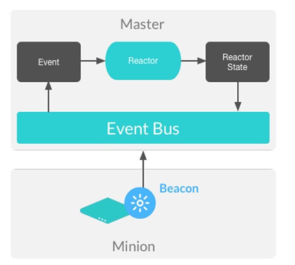

.. _beacons:

=======
Beacons
=======

Use case
========
Beacons are a monitoring tool that is set up on the salt-minion process to expand its utility.
Beacons can reduce the need for user-triggered configuration and management because they enable autonomous monitoring and event publishing that are triggered by designated system processes.

Beacons can be leveraged for a number of purposes:

* Automated reporting
* Error log delivery
* Microservice monitoring
* User shell activity
* Resource monitoring

When coupled with reactors, an additional Salt master side feature, beacons can create automated pre-written responses to infrastructure and application issues.

Minion configuration
====================
When configuring the beacon on the Salt minion, no modification to the intended process monitoring needs to take place.

The ``disable_during_state_run`` argument may be set.
If a state run is in progress, the beacon will not run on its regular interval until the minion has completed the state run, at which point the normal beacon interval will resume.

.. code-block:: yaml
   :caption: /etc/salt/minion.d/beacons.conf

    beacons:
      inotify:
        - files:
            /etc/named.conf:
               mask:
                 - close_write
                 - create
                 - delete
                 - modify
           /etc/named/zones:
               mask:
                 - close_write
                 - create
                 - delete
                 - modify
        - disable_during_state_run: True
    service:
      - services:
          named:
            onchangeonly: True
    diskusage:
      - /: 50%
      - /var: 90%
      - interval: 120

When you are developing a beacon, if you need additional logic to execute, such as closing file handles for the ``disable_during_state_run``, you can add a ``close()`` function to the beacon.

Beacon published events
=======================
When using the beacon to observe a process, the external events are converted to a dictionary report for the event bus on the master.

The previous configuration would trigger an event such as:

.. code-block:: text

    salt/beacon/20190418-sosf-ubuntu/diskusage/ {
        "_stamp": "2019-05-06T18:52:14.288448",
        "diskusage": 85.5,
        "id": "20190418-sosf-ubuntu",
        "mount": "/"
    }
    salt/beacon/20190418-sosf-master/inotify//etc/named.conf {
        "_stamp": "2019-05-06T19:30:35.397508",
        "change": "IN_IGNORED","id": "20190418-sosf-master",
        "path": "/etc/named.conf"
    }

Managing at the terminal
========================
Beacons for minions can be added in the Salt master terminal. However, this will only load the beacon into memory on the Salt minion.

.. code-block:: bash

    salt '*' beacons.add ps "{'salt-master':'stopped', 'apache2':'stopped'}"

To keep a beacon persistent after deployment from the terminal, you can have the beacon written to YAML in ``/etc/salt/minion.d/beacons.conf`` on the minion.

.. code-block:: bash

    salt '*' beacons.save

A list of beacons can be generated by running:

.. code-block:: bash

    salt '*' beacons.list

Run the following to delete a beacon:

.. code-block:: bash

    salt '*' beacons.delete ps

Beacons disabled individually or collectively:

.. code-block:: bash

    salt '*' beacons.disable_beacon ps
    salt '*' beacons.disable

Beacons enabled individually or collectively:

.. code-block:: bash

    salt '*' beacons.enable_beacon ps
    salt '*' beacons.enable

Pillar deployed beacon
======================
Beacons can be deployed to minions, using pillar configurations that target the minions that should receive the beacon.

When set in pillar, the beacon should then be added to the pillar top file, to target specific minions that should have the beacon configuration.

.. code-block:: sls
   :caption: /srv/pillar/load_beacon.sls

   beacons:
     load:
       - 1m:
         - 0.0
         - 2.0
       - interval: 10

The top file would then target minions for this beacon:

.. code-block:: sls

   :caption: /srv/pillar/top.sls

   base:
     '*':
       - load_beacon

Updating the pillar will deliver the beacon to the minion in memory:

.. code-block:: bash

    salt \* saltutil.refresh_pillar
    salt \* beacons.list
    rebel_01:
        beacons:
          load:
          - 1m:
            - 0.0
            - 2.0
          - interval: 10

Then save the beacon to the filesystem for permanents:

.. code-block:: bash

    salt \* beacons.save
    rebel_01:
        ----------
        comment:
           Beacons saved to /etc/salt/minion.d/beacons.conf.
        result:
           True

State deployed beacon
=====================
Another method to deploy beacons is to use states with a normal ``file.managed`` operation.
As a best practice, the ``beacon.conf`` file will sit next to the managing Salt state for deployment.

.. code-block:: yaml
   :caption: /srv/salt/beacons/beacons.conf

   beacons:
     load:
       - 1m:
         - 0.0
         - 2.0
       - interval: 10

.. code-block:: yaml
   :caption: /srv/salt/beacons/init.sls

   add_load_beacon:
     file.managed:
       - name: /etc/salt/minion.d/beacons.conf
       - source: salt://beacons/beacons.conf

   min_restart_for_load_beacon:
     cmd.run:
       - name: 'systemctl restart salt-minion'

Running the beacon job will result in the salt-minion failing to return a job report to the salt-master, because of restarting to have the beacon configuration loaded:

.. code-block:: bash

    salt rebel_01 state.sls beacons
    rebel_01:
        Minion did not return. [No response]

After allowing a moment for the salt-minion to restart, you can see its functioning with the beacons module:

.. code-block:: bash

    salt rebel_01 test.version
    rebel_01:
       2019.2.3

    salt rebel_01 beacons.list
    rebel_01:
       beacons:
       load:
       - 1m:
         - 0.0
         - 2.0
       - interval: 10
