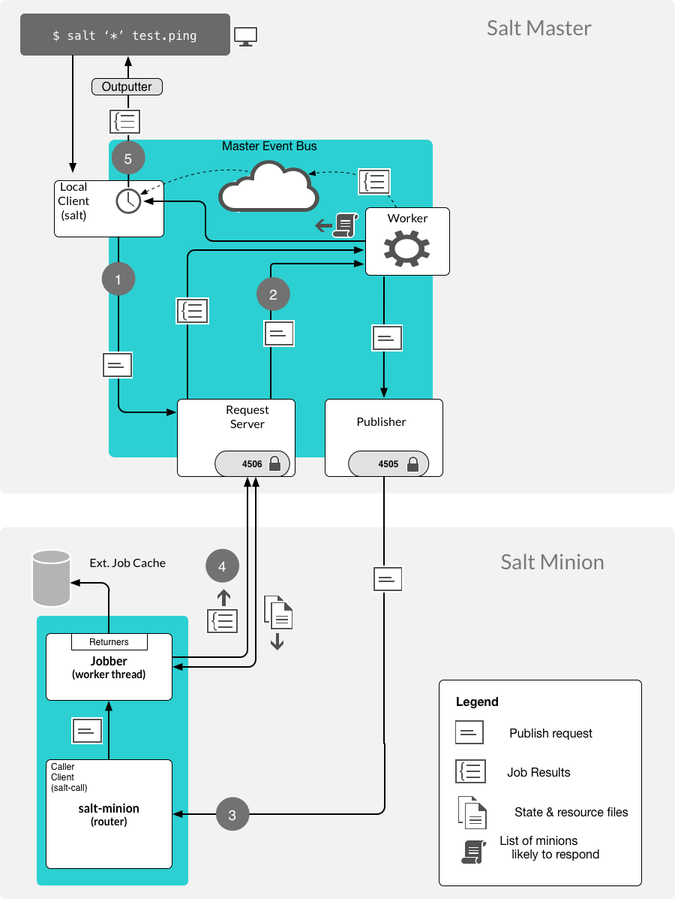

.. _execution-architecture:

======================
Execution architecture
======================

Salt execution
==============

One of the key concepts of Salt is the execution of jobs. This section shows the fundamentals of managing Salt jobs.

* The Salt master is built on the concept of an event bus.
* It provides for inter-process communication through UNIX domain sockets (UDX).
* Events are created and shared in a publish/subscribe (PUB/SUB) manner.
* Anytime the master wants to share information it publishes data on the event bus and anyone can subscribe to it.
* The event bus is used for both inter-process communication and network transport in Salt.

Types of execution
==================

Salt commands execute in different ways. The three types of execution are:

* Remote execution of jobs from the Salt master to Salt minions
* Execution of jobs directly on the Salt master
* Local execution of jobs on the Salt minion

.. image:: ../_static/img/salt-execution-types.jpg
   :align: right
   :alt: Salt execution types

Each command is just a wrapper around an API client interface. The command to run determines where you are (Salt master or minions) and where you want the command to run (Salt master or minion).

Salt components
===============

The components of the Salt topology are:

* The Salt server: ``salt-master`` service
* The Salt client: the ``salt`` command
* The Salt agent: ``salt-minion`` service

The ``salt`` client can only be run on the Salt master. It is the remote execution utility to interface with the Salt master-minion architecture.

Calling modules locally on a minion
===================================

Salt modules to be called locally on the Salt minion bypassing the master by using the ``salt-call`` command.

* The Salt functions make up a rich API for system management.
* These functions are all available for execution directly on the minion.

Salt Call is an effective tool for both accessing the Salt functions without needing to run through the Salt master, but to also debug operation on a minion. Some complex operations, like configuration management can be more easily debugged if run locally with ``salt-call``.

.. code-block:: bash

    salt-call pkg.install httpd

Bypassing the Salt master completely
------------------------------------

Some functions reference calls to the Salt master.

To run salt-call locally, as if there was no Salt master running.

.. code-block:: bash

    salt-call --local state.sls core.vim

.. Note::
   Additional configuration would be necessary if defining pillar data outside of a master.

Return code passthrough
=======================

The return code of the function can be passed to the command-line instead of the one returned by the ``salt-call`` utility.

.. code-block:: bash

    # This returns the success return code
    salt-call cmd.run 'grep 127.0.0.1 /etc/hosts' --retcode-passthrough echo $? 0

.. code-block:: bash

    # This returns an error
    salt-call cmd.run 'grep 127.0.0.101 /etc/hosts' --retcode-passthrough echo $? 1

Sending jobs to the Salt master
===============================

The ``salt-run`` command sends jobs to the Salt master daemon by executing runner modules. A job to view jobs on the master is send using:

.. code-block:: bash

    salt-run jobs.active

A job to tell the Salt master to power on a Dell server:

.. code-block:: bash

    salt-run drac.poweron drac01.example.com

Checking jobs on the minion
---------------------------

Active jobs can be viewed on the master by running ``salt-run jobs.active``.

Running jobs can be queried directly on a minion using the ``saltutil`` execution module. The ``saltutil`` execution module on minions is used to manage jobs and Salt specific operations.

``saltutil.running``, returns the data on all running salt processes on the minion.

.. code-block:: bash

    # running locally
    salt-call saltutil.running

    # or from the master
    salt web01 saltutil.running

``saltutil.is_running``, checks to see if the named function is running and returns the data associated with it/them.

.. code-block:: bash

    salt-call saltutil.is_running state.highstate

The event system
================

Salt maintains an event system that uses socket level transport to fire local publications on a local UNIX socket.

* Events are fired for a number of situations on the Master and can be listened to by external applications.
* The event system is made available on the minion and master as a somewhat open event bus.
* The same system user that the minion or master is running as can fire events using the salt event API.

Types of Salt events
--------------------

The Salt master has the following types of events:

* authentication
* start
* key
* job
* presence
* cloud

Event components
----------------

The event system sends two pieces of information. The tag and the data items.

* The tag is a string and the data is any simple data structure.
* The data will be serialized by Salt into a MessagePack string.

When using the event API all of the serialization and management will be automatically managed. Salt master events are documented at:

* `Salt Master Events <https://docs.saltproject.io/en/latest/topics/event/master_events.html>`__

Job events
----------

The structure of a new job is:

* ``Tag``: ``salt/job/<JID>/new``
* ``Data``:

  * ``jid``: The job ID.
  * ``tgt``: The target of the ``job.*``, a minion ID, ``G@os_family:RedHat``, etc.
  * ``tgt_type``: The type of targeting used: glob, grain, compound, etc.
  * ``fun``: The function to run on minions: test.ping, network.interfaces, etc.
  * ``arg``: A list of arguments to pass to the function that will be called.
  * ``minions``: List of minion IDs that Salt expects will return data for this job.
  * ``user``: The name of the user that ran the command as defined in Salt’s Publisher ACL or external authentication.

Events on the master can be viewed by running one of the commands below:

.. code-block:: bash

    # view with runner
    salt-run state.event pretty=True

    # view with python utility
    python eventlisten.py

    # view with daemon in foreground
    salt-master -l debug

The eventlisten.py script
-------------------------

A way to view events on the event bus is to use a script called the ``eventlisten.py``.

.. code-block:: text

    Event fired at Tue Nov 8 09:52:04 2016
    *************************
    Tag: salt/job/20161108095204099274/new
    Data: {'_stamp': '2016-11-08T14:52:04.100044',
    'arg': ['eth0'],
    'fun': 'network.hwaddr',
    'jid': '20161108095204099274',
    'minions': ['cweb',
    'master',
    'redis',
    'sdev',
    'uarchive'], 'tgt': '*',
    'tgt_type': 'glob',
    'user': 'root'}

Salt master processes
=====================

When a Salt master starts up, a number of processes are started, all of which are called ``salt-master`` in a process list but have various role categories.

The ``salt-master`` daemon performs functions such as:

* authenticating minions
* authenticating users
* handling returned data
* acting as a fileserver
* rendering pillar data
* sending, and receiving requests from connected minions
* sending and receiving requests and replies to the ``salt`` CLI Salt master

Processes created are:

* a Process Manager
* a Multiprocessing Logging Queue
* a Publisher (ZeroMQ Publishing Server Channel)
* an EventPublisher
* a Maintenance
* a Reactor
* a Request Server (Process Manager)
* a number of MWorker processes (``worker_threads``)

The Salt master tree has the following structure:

.. code-block:: text

    ProcessManager
    \_ MultiprocessingLoggingQueue
    \_ ZeroMQPubServerChannel
    \_ EventPublisher
    \_ Maintenance
    \_ Reactor
    \_ ReqServer_ProcessManager
    \_ MWorkerQueue
    \_ MWorker-0
    \_ MWorker-1
    \_ MWorker-2
    \_ MWorker-3
    \_ MWorker-4

Inter-process communication
---------------------------

The inter-process communication (IPC) requires Salt processes to authenticate with each other.

There are two rules governing if functions are passing data in clear or encrypted formats:

* ``ClearFuncs`` is used for intra-master communication and during the initial authentication handshake between a minion and master during the key exchange.
* ``AESFuncs`` is used everywhere else.

Publisher
---------

The Publisher process is responsible for sending commands over the designated transport to connected minions.

The Publisher is bound to the following:

* TCP: Port ``4505``
* IPC: ``publish_pull.ipc``

Each Salt minion establishes a connection to the master Publisher.

EventPublisher
--------------

The EventPublisher publishes events onto the event bus.

It is bound to the following:

* IPC: ``master_event_pull.ipc``
* IPC: ``master_event_pub.ipc``

MWorkers
--------

Worker processes manage the back-end operations for the Salt master. The number of workers is equivalent to the number of ``worker_threads`` specified in the master configuration and is always at least one.

Workers are bound to the following:

* IPC: ``workers.ipc``

Request server (ReqServer)
--------------------------

The Salt request server takes requests and distributes them to available MWorker processes for processing. It also receives replies back from minions.

The ReqServer is bound to the following:

* TCP: Port ``4506``
* IPC: ``workers.ipc``

Each Salt minion establishes a connection to the master ReqServer.

The Salt execution architecture
===============================

One of the main concepts to understand about Salt is that it is asynchronous in every place possible through the execution process.

That is the foundation on which it knows when to give up, reply, and when to display information.

The following diagram shows the basic execution path through the components of Salt. In this example the command ``salt \* test.ping`` is executed on the Salt master.

Looking at an example of Salt command execution path we see the following:

#. The ``salt`` command creates the command and waits 5 seconds unless otherwise specified.

   #. The ``salt`` command is a wrapper to the LocalClient API interface that is a component used for the Salt remote execution architecture.
   #. The initial interrogation of the command is performed.
   #. The request is first sent to the Salt master’s request server on port 4506.
   #. The salt-master ReqServer sees the request and passes it to an available MWorker over workers.ipc.

#. If the command is correct then a worker process is created to process the request. The number of worker processes available is configured using the ``worker_threads`` option.

   #. If the ``salt-master`` has insufficient worker processes then the command will not continue. If there are enough then execution continues.
   #. If one is available then a worker picks up the request and handles it.
   #. This happens in ``ClearFuncs.publish()``
   #. It checks to ensure that the requested user has permissions to issue the ``command.(e)`` The master creates a list of expected minions to return.
   #. The worker announces on the master event bus that it is about to publish a job to connected minions by placing the event on the master event bus (``master_event_pull.ipc``).
   #. The EventPublisher picks it up and distributes it to all connected event listeners on ``master_event_pub.ipc``.
   #. The message to the minions is encrypted and sent to the Publisher via IPC ``onpublish_pull.ipc``.
   #. Connected minions have a TCP session established with the Publisher on TCP port 4505 where they await commands.
   #. When the Publisher receives the job over ``publish_pull``, it sends the jobs across the wire to the minions for processing.

#. All minions receive the published command because each is listening to port 4505 on the master, but only minions that match the targeting criteria process the request.

   When a Salt minion starts up, it attempts to connect to the Publisher(4505) and the ReqServer(4506) on the Salt master. It then attempts to authenticate, and once the minion has successfully authenticated, it listens for jobs.

   This is a self-selecting evaluation by the minion to determine if it should act.

   For example, if a request was sent with the target of web01 all minions would receive the published command, but only the minion with the id of web01 would process it.

   #. The minion is polling its receive socket that’s connected to the master Publisher(TCP 4505 on master).
   #. After the minion receives the request, it decrypts it.
   #. The salt-minion service (aka ``router``) monitors the Salt master’s publisher port.
   #. The salt-minion is a single process that sits on machines to be managed by Salt.
   #. Similar to the master, a salt-minion has its own event system that operates overIPC by default.

      The minion event system operates on a push/pull system with IPC files at ``minion_event_<unique_id>_pub.ipc`` and ``minion_event_<unique_id>_pull.ipc``.

      An event system is needed with a single-process daemon because the salt-minion may fork other processes as required to do the work without blocking the main salt-minion process.

      * This necessitates a mechanism by which those processes can communicate with each other.
      * This provides a bus by which any user with sufficient permissions can read or write to the bus as a common interface with the Salt minion.

   #. If the minion determines that it should process the request then it double-pid fork a process so that it can be done asynchronously to prevent any blocking.

      The main thread was only blocked for the time that it took to initialize the worker thread, many other requests could have been received and processed during this time.

      * The process is provided with the contents of the decrypted message.
      * Each forked process is referred to as a jobber.

   #. The minion determines what resources and retrieves from the master any not already installed local or cached. Resources include Salt states, pillar data, and configuration files.
   #. The minion calls the Salt function and executes work (still in the jobber).
   #. The function calls can be thought of running salt-call, but with the output returned to the Salt master.
   #. If an external job cache, or returner is configured then the returned data is sent to each one.
   #. When the minion is ready to respond, it publishes the result of its job back to the master by sending the encrypted result back to the master on TCP 4506.

#. Once the data is returned to the master then an event system router/dealer pattern is used to allocate worker processes to prevent blocking.

   This is important if the master had thousands of minions responding at the same time.

   Job returns in Salt are processed in Python coroutines, which allows Salt to maximize processors.

   #. It is again picked up by the ReqServer and forwarded to an available MWorkerfor processing. (Again, this happens by passing this message across workers.ipc to an available worker.)
   #. When the MWorker receives the job it decrypts it and fires an event onto the master event bus (``master_event_pull.ipc``). (This happens in ``AESFuncs._return()``).
   #. The EventPublisher sees this event and re-publishes it on the bus to all connected listeners of the master event bus (on ``master_event_pub.ipc``). This is where the LocalClient has been waiting, listening to the event bus for minion replies. It gathers the job and stores the result.
   #. Minions listening to the Master’s event bus will also see the result of the master's event from the publisher port.
   #. When all targeted minions have replied or the timeout has been exceeded, the salt client displays the results of the job to the user on the CLI.

#. The CLI will display the return data. It will pass the data to the referenced outputter.

   * The default outputter is the *nested* outputter.
   * Also, data is displayed in the order received unless the ``--static`` is passed.

.. Note::
   Pressing ``Control+C`` will exit the salt command line, but will not kill or stop the job.

Longer execution
----------------

An understanding of the asynchronous execution framework shows that sending jobs in the background to decouple the job monitoring with the execution.

In other words, the administrator will check on the running jobs on the minions by looking them up. Jobs that are expected to take a considerable amount of time should be started with the ``--async`` option.

This option immediately puts the job in the background since a full system upgrade is called for all systems:

.. code-block:: bash

    salt --async \* pkg.upgrade
