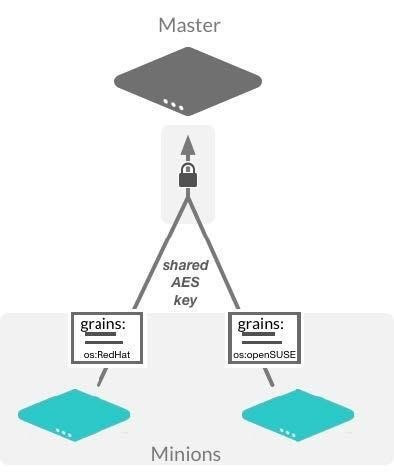

.. _salt-grains:

===========
Salt grains
===========

Use case
========
Salt comes with an interface to derive information about the underlying
system. This is called the grains interface, because it presents Salt
with grains of information. Grains are collected for the operating
system, domain name, IP address, kernel, OS type, memory, and many other
system properties.

The grains interface is made available to Salt modules and components so
that the right Salt minion commands are automatically available on the
right systems.

Grain data is relatively static. However, if system information changes
(such as network settings), or if a new value is assigned to a custom
grain, grain data is refreshed.

.. note::

   Grains resolve to lowercase letters. For example, ``FOO`` and ``foo``
   target the same grain.

Grains of Salt key concepts          
---------------------------
The following are some key concepts about grains:

*  Grains comprise system properties or other custom attributes.
*  Though grains can be defined in several ways, they are always derived
   or defined on the minion.
*  Grains cover data such as: ``os``, ``kernel``, ``ip_interfaces``, and
   ``minion`` id.
*  Grains are generally used to determine things like which package
   manager should be used or if the init system is powered by systemctl.
*  The grains interface is available to Salt modules and components so
   that the right Salt minion commands are automatically available on
   the right systems.

Grains terminal commands
========================

Listing grains
--------------
Available grains can be listed by using the ``grains.ls``  module:

.. code-block:: bash

   salt '*' grains.ls

Grains data can be listed by using the ``grains.items`` module:

.. code-block:: bash

   salt '*' grains.items

Targeting with grains
---------------------
Grain data can be used when targeting minions.

For example, the following command matches all CentOS minions:

.. code-block:: bash

   salt -G 'os:CentOS' test.version

This command matches all minions with 64-bit CPUs, and return number of
CPU cores for each matching minion:

.. code-block:: bash

   salt -G 'cpuarch:x86_64' grains.item num_cpus

Additionally, globs can be used in grain matches, and grains that are
nested in a dictionary can be matched by adding a colon for each level
that is traversed. For example, the following command will match hosts
that have a grain called ``ec2_tags``, which itself is a dictionary with a
key named environment and which has a value that contains the word
production:

.. code-block:: bash

   salt -G 'ec2_tags:environment:*production*'

Configuration settings          
======================
To automatically accept minions based on certain characteristics, such
as the uuid, you can specify certain grain values on the Salt master.
Minions with matching grains will have their keys automatically
accepted.

#. Configure the ``autosign_grains_dir`` in the Salt master config file:

   .. code-block:: yaml
      :caption: /etc/salt/master.d/grains.conf
      :name: /etc/salt/master.d/grains.conf

      autosign_grains_dir: /etc/salt/autosign_grains

#. Configure the grain values to be accepted:

   Place a file named like the grain in the ``autosign_grains_dir`` and write
   the values that should be accepted automatically inside that file. For
   example, to automatically accept minions based on their uuid, create a
   file named:

   .. code-block:: text
      :caption: /etc/salt/autosign_grains/uuid
      :name: /etc/salt/autosign_grains/uuid

      8f7d68e2-30c5-40c6-b84a-df7e978a03ee
      1d3c5473-1fbc-479e-b0c7-877705a0730f

   The Salt master is now set up to accept minions with either of the two
   specified uuids. Multiple values must always be written into separate
   lines. Lines starting with a # are ignored.

#. Configure the Salt minion, to send the specific grains to the Salt master,
   in the ``minion`` config file:

   .. code-block:: yaml
      :caption: /etc/salt/minion
      :name: /etc/salt/minion

      autosign_grains:
        - uuid

Now you should be able to start ``salt-minion`` and run ``salt-call
state.apply`` or any other Salt commands that require Salt master
authentication.

Defining custom grains
======================
Custom grains can be set using various methods:

* Using remote execution
* Editing the ``/etc/salt/grains`` configuration file
* Editing the minion configuration custom config file in ``/etc/salt/minion.d/``
* Using a custom grains module.

Grains can be set dynamically at the command-line (remote execution):

.. code-block:: bash

    salt minion01 grains.setval deployment datacenter4

The following is an example of setting a multi-value grain:

.. code-block:: bash

    salt minion01 grains.setval roles ['web', 'app1', 'dev']

The previous examples will update the grains dictionary in memory and
persistently in the ``/etc/salt/grains`` file on the minion.

.. Note::
    If this file is edited manually, the grain dictionary will be dynamically
    updated and available as soon as the file is written.

To statically set the grain data, add the data to the minion configuration. It
is recommended to create a custom minion configuration file in the
``/etc/salt/minion.d/`` directory.

.. code-block:: yaml
   :caption: /etc/salt/minion.d/grains.conf
   :name: /etc/salt/minion.d/grains.conf

   grains:
     deployment: datacenter4
     cabinet: 14
     switch_port: 4
     roles:
       - web
       - app1
       - dev

.. Note::
    Adding/updating grains using the minion configuration will require a restart
    of the ``salt-minion`` process.

Matching via a custom grain:

.. code-block:: bash

    salt -G 'roles:app1' test.ping

The previous examples also illustrate an important point about grains values:

* Grains can be any common data structure: string, int, list, boolean or
  dictionary.
* When matching a grain that is a list, only a single list item will need to be
  matched. Therefore, the role grain could be matched with either web, app1, or
  dev.

Precedence
==========
Core grains can be overridden by custom grains. As there are several ways of
defining custom grains, there is an order of precedence which should be kept in
mind when defining them. The order of evaluation is as follows:

#. Default salt defined core grains.
#. Custom grains in ``/etc/salt/grains`` on the minion.
#. Custom grains in ``/etc/salt/minion`` on the minion.
#. Custom grain modules in ``_grains`` directory on the master and synced to the
   minion.

Each successive evaluation overrides the previous ones, so any grains defined by
custom grains modules synced to minions that have the same name as a core grain
will override that core grain. Similarly, grains from ``/etc/salt/minion``
override both core grains and custom grain modules, and grains in ``_grains``
will override any grains of the same name.

For custom grains, if the function takes an argument grains, then the previously
rendered grains will be passed in. Because the rest of the grains could be
rendered in any order, the only grains that can be relied upon to be passed in
are core grains. This was added in the 2019.2.0 release.

States with grains
==================
The grains dictionary makes the minion's grains directly available, and is
available in all templates:

.. code-block:: bash

    {{ grains['os'] }}

.. Note::
   The syntax here will cause an error if the grain does not exist.

The ``grains.get`` function can be used to traverse deeper grains and set
defaults:

.. code-block:: text

    {{ salt['grains.get']('os') }}
    {{ salt['grains.get']('os', ‘Debian’) }}

.. Note::
    The syntax used here will result in “None” being returned if the grain does
    not exist.
