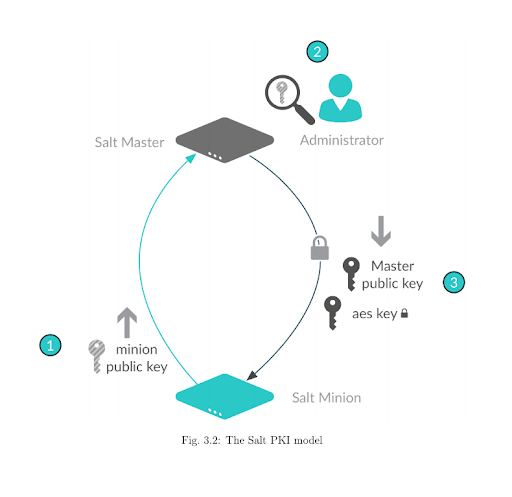

.. _salt-installation:

===============================
Salt install, config, and start
===============================

Salt Project repository configuration
=====================================
Salt Project provides a public repository for packages at: `https://repo.saltproject.io/ <https://repo.saltproject.io/>`_

Salt is often distributed in split packages by distributions, and only salt-master & salt-minion are required for salt to function. The preferred method for installing Salt is via distribution packages. This will ensure that all dependencies are met and that Salt is installed in a tested and distribution aligned way.

.. note::

   The following examples only cover a few operating systems. For directions
   on installing on a wider variety of operating systems, reference the
   directions found on `https://repo.saltproject.io/ <https://repo.saltproject.io/>`__.

Salt package yum installation
-----------------------------
Operating systems in the RedHat family install via yum:

#.  Add the Salt repository.

    .. code-block:: bash

        sudo rpm --import https://repo.saltproject.io/py3/redhat/8/x86_64/latest/SALTSTACK-GPG-KEY.pub
        curl -fsSL https://repo.saltproject.io/py3/redhat/8/x86_64/latest.repo | sudo tee /etc/yum.repos.d/salt.repo

#.  Refresh/expire your local package cache (not always necessary).

    .. code-block:: bash

        sudo yum clean expire-cache

#.  Install packages.

    .. code-block:: bash

        sudo yum install salt-master
        sudo yum install salt-minion

Salt package apt installation
-----------------------------
Operating systems in the Debian family install via apt

#.  Add the Salt repository.

    .. code-block:: bash

       # Download key
       sudo curl -fsSL -o /usr/share/keyrings/salt-archive-keyring.gpg https://repo.saltproject.io/py3/ubuntu/20.04/amd64/latest/salt-archive-keyring.gpg
       # Create apt sources list file
       echo "deb [signed-by=/usr/share/keyrings/salt-archive-keyring.gpg] https://repo.saltproject.io/py3/ubuntu/20.04/amd64/latest focal main" | sudo tee /etc/apt/sources.list.d/salt.list

#.  Install packages.

    .. code-block:: bash

       sudo apt install salt-master
       sudo apt install salt-minion

Salt package pip installation
-----------------------------
An operating system agnostic installation of Salt is via pip from pypi.org. Pip is a python package installer you are likely to use for installing other python packages to compliment your Salt code.

#.  Install package.

    .. code-block:: bash

       pip install salt

A benefit of using pip is being able to install salt in python virtual environments and conda environments.

Bootstrap install Salt
======================
The Salt Bootstrap `project <https://bootstrap.saltproject.io>`_ maintains a shell script to install Salt on any Linux/Unix platform in the best way possible for the platform.

* Install from system packages
* Enables salt services automatically

The bootstrap script can be used to install specific services:

.. code-block:: bash

    # Download the install script
    curl -o bootstrap-salt.sh -L https://bootstrap.saltproject.io

    # Install minion service (default)
    ./bootstrap-salt.sh

    # Install both the Salt master and minion
    ./bootstrap-salt.sh -M

    # Install just the Salt master service
    ./bootstrap-salt.sh -M -N

    # Perform a pip-based installation (i.e., for a minion)
    ./bootstrap-salt.sh -P

    # To download and run
    curl -L https://bootstrap.saltproject.io | sudo sh -s --

    # To download and install a specific git branch/version
    curl -L https://bootstrap.saltproject.io | sudo sh -s -- git develop

Salt network ports
==================
The Salt master/minion model only requires inbound connections into the Salt master. Since the connection is established from the minion and never from the master.

Very briefly, the following image shows that the ``salt-master`` offers two services to the minions.

* ``4505`` - Event Publisher/Subscriber port (publish jobs/events)
    * Constant inquiring connection

* ``4506`` - Data payloads and minion returns (file services/return data)
    * Connects only to deliver data

.. image:: ../_static/img/minion-subcription-publication-model.jpg
   :align: right
   :alt: Minion subscription publication

.. Note::
    Minions do not have to have a master to be managed. A ``salt-minion`` can execute commands locally via ``$ salt-call --local [module.function]``.

Basic master configuration
==========================

* The ``salt-master`` comes with default server configurations.
* The default master yaml config at ``/etc/salt/master`` contains all the commented settings.
* Custom settings are added in yaml to ``/etc/salt/master.d/`` as ``.conf`` files on the master.
* The default master file should be used for referencing settings as needed.

Salt master network settings
----------------------------
The default setting is for the master to bind to all available network interfaces. It then listens on ports 4505 and 4506.

An example to override those default settings:

.. code-block:: yaml
    :caption: /etc/salt/master.d/network.conf

    # The network interface to bind to
    interface: 192.168.42.20

    # The Request/Reply port
    ret_port: 4506

    # The port minions bind to for commands, aka the publish port
    publish_port: 4505

Salt master process management
------------------------------
To manage the ``salt-minion`` return calls, the master threads out worker processes with the ``worker_threads`` setting. The default limit for the processes is 5 workers; this setting has a minimum of 3.

If your cluster has 1000’s of minions and you are experiencing minion report stalling, the master might be timing out the time window for minions to respond to a job. This doesn’t mean the minions failed their job; rather, it could mean the master doesn’t have enough worker threads to process all the reports.

Hence we will raise the ``worker_threads`` setting in a master configuration file:

.. code-block:: yaml
    :caption: /etc/salt/master.d/thread_options.conf

    worker_threads: 5

Standards for busy environments:

* 1 worker thread per 200 minions
* ``worker_threads`` should not exceed 1½ times the available cpu cores

Basic minion configuration
===========================
* The ``salt-minion`` comes default with a DNS/hostname configuration setup.
* The default minion yaml config at ``/etc/salt/minion`` contains all the commented settings.
* Custom settings are added in yaml to ``/etc/salt/minion.d/`` as ``.conf`` files on the minion.
* The default minion file should be used for referencing settings as needed.

Connecting to the Salt master
-----------------------------
By default the minions will assume that the Salt master can be resolved in DNS via the hostname ``salt``.

An example to override the hostname default setting:

.. code-block:: yaml
    :caption: /etc/salt/minion.d/master.config

    master: 192.168.42.20

Declaring the minion ID
-----------------------
The salt-minion will identify itself to the master by the system’s hostname unless explicitly set in its settings.

.. code-block:: yaml
    :caption: /etc/salt/minion.d/id.conf

    id: rebel_1

Salt key exchange
=================
Salt uses key-based authentication for security.

There are 2 types of keys used in Salt:

* RSA
* AES

Salt keys
---------
The RSA keys are the backbone to the authentication and encryption model used by Salt. All Salt daemons run with unique RSA keys. The minions and master generate RSA keys when they start for the first time and use them for PKI-based authentication. These keys are used to authenticate and to pass the AES key for secure communication by encrypting data.

In order to interact with the Salt environment, each minion presents a public key to the Salt master. The key is then examined, compared, and explicitly accepted by an administrator. A minion is blocked from the Salt environment until its key is accepted.

The master also sends a rotating AES key that is used to encrypt and decrypt messages sent by the Salt master. The returned AES key is encrypted using the public key initially sent by the Salt minion, and can therefore be decrypted only by the same Salt minion.

.. Note::
    Salt minions do not receive any data from the Salt master until the key is accepted.

Managing keys
-------------
The ``salt-key`` command is used to interface with the authentication system and accept, reject, and otherwise manage keys.

Accepting keys
--------------
When a new minion checks in, the key will wait in ``Unaccepted keys`` until it is accepted.

To see the current state of key management, call ``salt-key``:

.. code-block:: bash

    $ salt-key
    Unaccepted keys:
    db1
    Accepted Keys:
    web1
    web2
    Rejected:
    badguy

In this example, to accept keys, run:

.. code-block:: bash

    salt-key -a db1

If there are multiple keys to accept and are trusted, you can accept all at once:

.. code-block:: bash

    salt-key -A

.. Warning::
    If the master is open to the internet this is considered a security vulnerability.

Deleting keys
-------------
Keys can also be deleted singularly or in bulk. Because this is a permanent action, it will  prompt for confirmation.

Deleting a single key:

.. code-block:: bash

    $ salt-key -d web1
    The following accepted key is set to be removed: web1
    web1
    [n/Y]

Deleting all keys:

.. code-block:: bash

    $ salt-key -D
    The following keys are going to be deleted:
    web1
    web2
    [n/Y]

Deleting keys via filter:

.. code-block:: bash

    $ salt-key -d 'web*'
    The following keys are going to be deleted:
    web1
    web2
    [n/Y]

Starting Salt services
======================
The main way to start salt processes is with ``systemctl`` and by calling the process directly to see their active logs in the foreground.

Start with systemctl
--------------------
When starting the ``salt-master`` and ``salt-minion``, ``systemctl`` is recommended.

.. code-block:: bash

    systemctl start salt-master
    systemctl start salt-minion

In fact, ``systemctl`` commands are useful for preliminary debugging as well, and you will most likely rely on this tool for process start/stop confirmation and preliminary debugging.

.. code-block:: bash

    systemctl [start|status|stop] [salt-master|salt-minion]

Starting in the foreground
---------------------------
The ``salt-master`` and ``salt-minion`` daemons can be run to show their logs in the terminal live by calling their process directly.

.. code-block:: bash

    salt-master
    salt-minion

Verifying a Salt installation
=============================
After a successful installation of Salt:

#.  Check the salt master is running and logs no errors with systemctl:

    .. code-block:: text

        $ systemctl status salt-master
        salt-master.service - The Salt Master Server
            Loaded: loaded (/lib/systemd/system/salt-master.service; enabled; vendor preset: enabled)
            Active: active (running) since Tue 2020-02-04 16:34:55 CST; 17h ago
              Docs: man:salt-master(1)
                    file:///usr/share/doc/salt/html/contents.html
                    https://docs.saltproject.io/en/latest/contents.html
          Main PID: 8727 (salt-master)
             Tasks: 32 (limit: 4915)
            CGroup: /system.slice/salt-master.service
                    ├─8727 /usr/bin/python2 /usr/bin/salt-master
        Feb 04 16:34:55 VM systemd[1]: Starting The Salt Master Server...

#.  Check cluster connection & version:

    .. code-block:: bash

        $ salt '*' test.version
        minion1:
            2019.2.3
