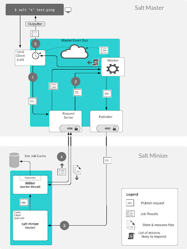
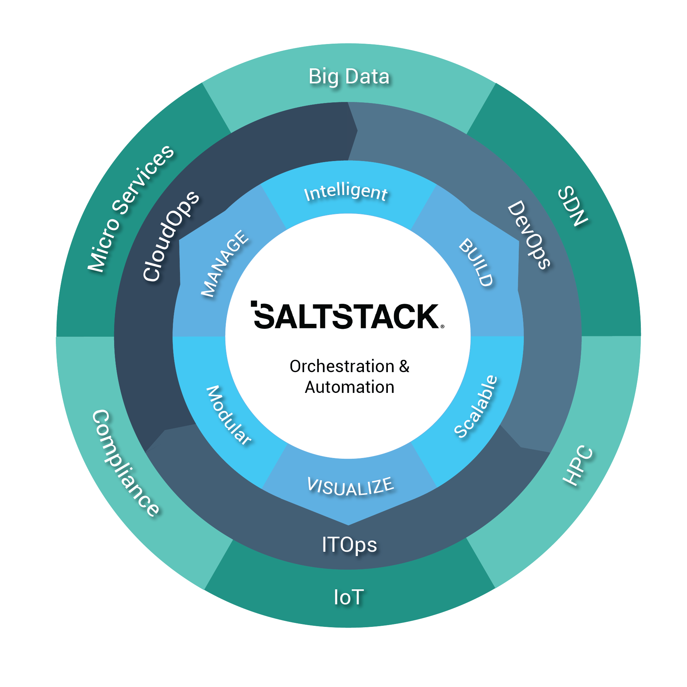
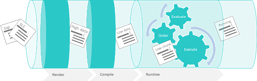
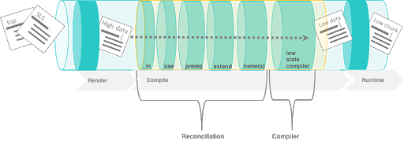
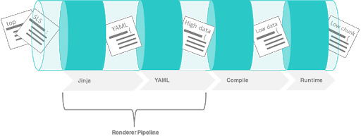
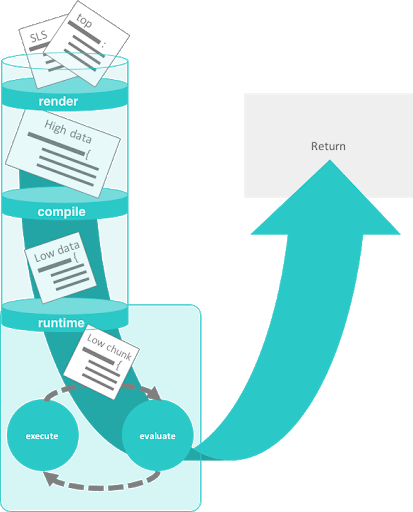
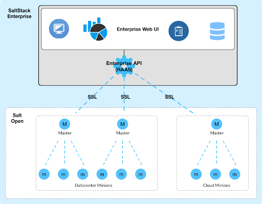

.. _list-of-images:

==============
List of images
==============

The following document shows all of the images that are currently available
in this repository and how to reference them.

All image files are stored in the **docs > _static > img** folder.

Default Configuration
=====================

.. image:: ../_static/img/default-configuration.png
   :align: right
   :alt: Default configuration

To copy the code for this image:

.. code-block:: text

    .. image:: ../_static/img/default-configuration.png
       :align: right
       :alt: Default configuration

Job overview
============

To copy the code for this image:

.. code-block:: text

    .. image:: ../_static/img/job-overview.png
       :align: right
       :alt: Job overview

Salt grains
===========

.. image:: ../_static/img/master-minion-communication.jpg
   :align: right
   :alt: Salt grains

To copy the code for this image:

.. code-block:: text

    .. image:: ../_static/img/master-minion-communication.jpg
       :align: right
       :alt: Salt grains

Master to minion flow
=====================

.. image:: ../_static/img/master-minion-flow.png
   :align: right
   :alt: Master to minion flow

To copy the code for this image:

.. code-block:: text

    .. image:: ../_static/img/master-minion-flow.png
       :align: right
       :alt: Master to minion flow

Master to minion cloud
======================

.. image:: ../_static/img/master-to-minion-cloud.png
   :align: right
   :alt: Master to minion cloud

To copy the code for this image:

.. code-block:: text

    .. image:: ../_static/img/master-to-minion-cloud.png
       :align: right
       :alt: Master to minion cloud

Minion subscription publication
===============================

.. image:: ../_static/img/minion-subcription-publication-model.jpg
   :align: right
   :alt: Minion subscription publication

To copy the code for this image:

.. code-block:: text

    .. image:: ../_static/img/minion-subcription-publication-model.jpg
       :align: right
       :alt: Minion subscription publication

Minion vs. master tasks
=======================

.. image:: ../_static/img/minion-vs-master-tasks.png
   :align: right
   :alt: Minion vs. master tasks

To copy the code for this image:

.. code-block:: text

    .. image:: ../_static/img/minion-vs-master-tasks.png
       :align: right
       :alt: Minion vs. master tasks

Orchestration and automation
============================

To copy the code for this image:

.. code-block:: text

    .. image:: ../_static/img/orchestration-automation.png
       :align: right
       :alt: Orchestration and automation

Order of operations 1
=====================

To copy the code for this image:

.. code-block:: text

    .. image:: ../_static/img/order-of-operations-01.png
       :align: right
       :alt: Order of operations

Order of operations 2
=====================

To copy the code for this image:

.. code-block:: text

    .. image:: ../_static/img/order-of-operations-02.png
       :align: right
       :alt: Order of operations

Order of operations 3
=====================

To copy the code for this image:

.. code-block:: text

    .. image:: ../_static/img/order-of-operations-03.png
       :align: right
       :alt: Order of operations

Order of operations 4
=====================

To copy the code for this image:

.. code-block:: text

    .. image:: ../_static/img/order-of-operations-04.png
       :align: right
       :alt: Order of operations

Proxy minion vs. standard minions
=================================

.. image:: ../_static/img/proxy-minion-vs-standard-minion.png
   :align: right
   :alt: Proxy minion vs. standard minions

To copy the code for this image:

.. code-block:: text

    .. image:: ../_static/img/proxy-minion-vs-standard-minion.png
       :align: right
       :alt: Proxy minion vs. standard minions

Render compile runtime
======================

.. image:: ../_static/img/render-compile-runtime.png
   :align: right
   :alt: Render compile runtime

To copy the code for this image:

.. code-block:: text

    .. image:: ../_static/img/render-compile-runtime.png
       :align: right
       :alt: Render compile runtime

Salt architecture
=================

.. image:: ../_static/img/salt-architecture.png
   :align: right
   :alt: Salt architecture

To copy the code for this image:

.. code-block:: text

    .. image:: ../_static/img/salt-architecture.png
       :align: right
       :alt: Salt architecture

Salt cloud
==========

.. image:: ../_static/img/salt-cloud.png
   :align: right
   :alt: Salt cloud

To copy the code for this image:

.. code-block:: text

    .. image:: ../_static/img/salt-cloud.png
       :align: right
       :alt: Salt cloud

Salt command
============

.. image:: ../_static/img/salt-command.png
   :align: right
   :alt: Salt command

To copy the code for this image:

.. code-block:: text

    .. image:: ../_static/img/salt-command.png
       :align: right
       :alt: Salt command

Salt PKI model
==============

.. image:: ../_static/img/salt-pki-model.png
   :align: right
   :alt: Salt PKI model

To copy the code for this image:

.. code-block:: text

    .. image:: ../_static/img/salt-pki-model.png
       :align: right
       :alt: Salt PKI model

Salt states
===========

.. image:: ../_static/img/salt-states.png
   :align: right
   :alt: Salt states

To copy the code for this image:

.. code-block:: text

    .. image:: ../_static/img/salt-states.png
       :align: right
       :alt: Salt states

SaltStack Enterprise architecture
=================================

To copy the code for this image:

.. code-block:: text

    .. image:: ../_static/img/saltstack-enterprise-architecture.png
       :align: right
       :alt: SaltStack Enterprise architecture
