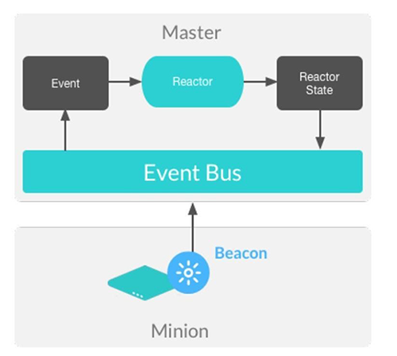
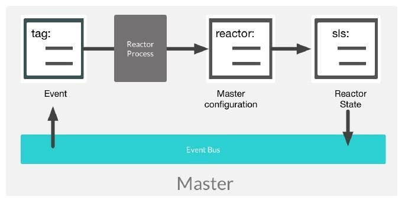
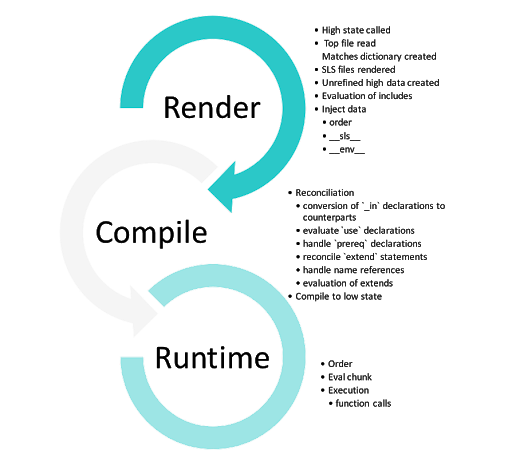
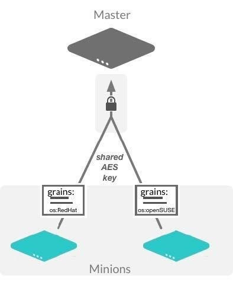
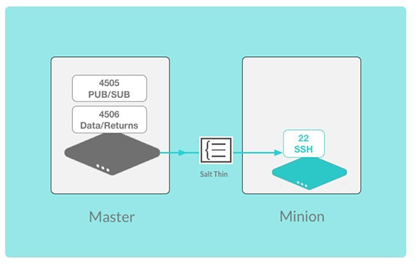

.. _list-of-images:

==============
List of images
==============

The following document shows all of the images that are currently available
in this repository and how to reference them.

All image files are stored in the **docs > _static > img** folder.

Beacons
=======

To copy the code for this image:

.. code-block:: text

    .. image:: ../_static/img/beacons.png
       :align: right
       :alt: Beacons

Execution architecture
======================

.. image:: ../_static/img/execution-architecture.png
   :align: right
   :alt: Execution architecture

To copy the code for this image:

.. code-block:: text

    .. image:: ../_static/img/execution-architecture.png
       :align: right
       :alt: Execution architecture

Features of Salt
================

.. image:: ../_static/img/features-of-salt.png
   :align: right
   :alt: Features of Salt

To copy the code for this image:

.. code-block:: text

    .. image:: ../_static/img/features-of-salt.png
       :align: right
       :alt: Features of Salt

Key management
==============

.. image:: ../_static/img/key-management.png
   :align: right
   :alt: Key management

To copy the code for this image:

.. code-block:: text

    .. image:: ../_static/img/key-management.png
       :align: right
       :alt: Key management

Master to minion flow
=====================

.. image:: ../_static/img/master-minion-flow.png
   :align: right
   :alt: Master to minion flow

To copy the code for this image:

.. code-block:: text

    .. image:: ../_static/img/master-minion-flow.png
       :align: right
       :alt: Master to minion flow

Master to minion cloud
======================

.. image:: ../_static/img/master-to-minion-cloud.png
   :align: right
   :alt: Master to minion cloud

To copy the code for this image:

.. code-block:: text

    .. image:: ../_static/img/master-to-minion-cloud.png
       :align: right
       :alt: Master to minion cloud

Minion subscription publication
===============================

.. image:: ../_static/img/minion-subcription-publication-model.jpg
   :align: right
   :alt: Minion subscription publication

To copy the code for this image:

.. code-block:: text

    .. image:: ../_static/img/minion-subcription-publication-model.jpg
       :align: right
       :alt: Minion subscription publication

Minion vs. master tasks
=======================

.. image:: ../_static/img/minion-vs-master-tasks.png
   :align: right
   :alt: Minion vs. master tasks

To copy the code for this image:

.. code-block:: text

    .. image:: ../_static/img/minion-vs-master-tasks.png
       :align: right
       :alt: Minion vs. master tasks

Open event system
=================

.. image:: ../_static/img/open-event-system.png
   :align: right
   :alt: Open event system

To copy the code for this image:

.. code-block:: text

    .. image:: ../_static/img/open-event-system.png
       :align: right
       :alt: Open event system

Proxy minion vs. standard minions
=================================

To copy the code for this image:

.. code-block:: text

    .. image:: ../_static/img/proxy-minion-vs-standard-minion.png
       :align: right
       :alt: Proxy minion vs. standard minions

Reactors
========

.. image:: ../_static/img/reactors.jpg
   :align: right
   :alt: Reactors

To copy the code for this image:

.. code-block:: text

    .. image:: ../_static/img/reactors.jpg
       :align: right
       :alt: Reactors

Reactor Process
===============

To copy the code for this image:

.. code-block:: text

    .. image:: ../_static/img/reactor-process.jpg
       :align: right
       :alt: Reactor process

Render compile runtime
======================

To copy the code for this image:

.. code-block:: text

    .. image:: ../_static/img/render-compile-runtime.png
       :align: right
       :alt: Render compile runtime

Runners
=======

.. image:: ../_static/img/runners.png
   :align: right
   :alt: Runners

To copy the code for this image:

.. code-block:: text

    .. image:: ../_static/img/runners.png
       :align: right
       :alt: Runners

Salt architecture
=================

.. image:: ../_static/img/salt-architecture.png
   :align: right
   :alt: Salt architecture

To copy the code for this image:

.. code-block:: text

    .. image:: ../_static/img/salt-architecture.png
       :align: right
       :alt: Salt architecture

Salt cloud
==========

.. image:: ../_static/img/salt-cloud.png
   :align: right
   :alt: Salt cloud

To copy the code for this image:

.. code-block:: text

    .. image:: ../_static/img/salt-cloud.png
       :align: right
       :alt: Salt cloud

Salt command
============

To copy the code for this image:

.. code-block:: text

    .. image:: ../_static/img/salt-command.png
       :align: right
       :alt: Salt command

Salt execution types
====================

.. image:: ../_static/img/salt-execution-types.jpg
   :align: right
   :alt: Salt execution types

To copy the code for this image:

.. code-block:: text

    .. image:: ../_static/img/salt-execution-types.jpg
       :align: right
       :alt: Salt execution types

Salt grains
===========

To copy the code for this image:

.. code-block:: text

    .. image:: ../_static/img/master-minion-communication.jpg
       :align: right
       :alt: Salt grains

Salt PKI model
==============

.. image:: ../_static/img/salt-pki-model.png
   :align: right
   :alt: Salt PKI model

To copy the code for this image:

.. code-block:: text

    .. image:: ../_static/img/salt-pki-model.png
       :align: right
       :alt: Salt PKI model

Salt states
===========

.. image:: ../_static/img/salt-states.png
   :align: right
   :alt: Salt states

To copy the code for this image:

.. code-block:: text

    .. image:: ../_static/img/salt-states.png
       :align: right
       :alt: Salt states

SaltStack Config architecture
=============================

.. image:: ../_static/img/saltstack-config-architecture.png
   :align: right
   :alt: SaltStack Config architecture

To copy the code for this image:

.. code-block:: text

    .. image:: ../_static/img/saltstack-config-architecture.png
       :align: right
       :alt: SaltStack Config architecture

SSH
===

To copy the code for this image:

.. code-block:: text

    .. image:: ../_static/img/ssh-master-minion.png
       :align: right
       :alt: SSH

States
======

.. image:: ../_static/img/states.png
   :align: right
   :alt: Salt states

To copy the code for this image:

.. code-block:: text

    .. image:: ../_static/img/states.png
       :align: right
       :alt: Salt states

State compiler routines
=======================

.. image:: ../_static/img/state-compiler-routines.png
   :align: right
   :alt: State compiler routines

To copy the code for this image:

.. code-block:: text

    .. image:: ../_static/img/state-compiler-routines.png
       :align: right
       :alt: State compiler routines

State execution rendering process
=================================

.. image:: ../_static/img/state-execution-rendering.png
   :align: right
   :alt: State execution rendering process

To copy the code for this image:

.. code-block:: text

    .. image:: ../_static/img/state-execution-rendering.png
       :align: right
       :alt: State execution rendering process

State runtime stage
===================

.. image:: ../_static/img/state-runtime-stage.png
   :align: right
   :alt: State runtime stage

To copy the code for this image:

.. code-block:: text

    .. image:: ../_static/img/state-runtime-stage.png
       :align: right
       :alt: State runtime stage

State stages and data layers
============================

To copy the code for this image:

.. code-block:: text

    .. image:: ../_static/img/state-stages-data-layers.png
       :align: right
       :alt: Stages and data layers of the Salt state system
