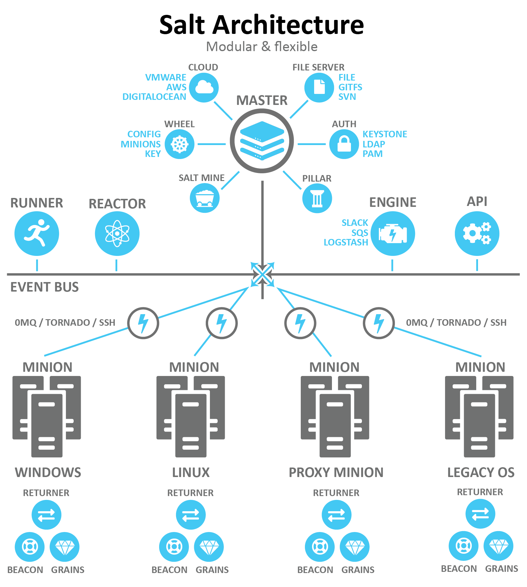
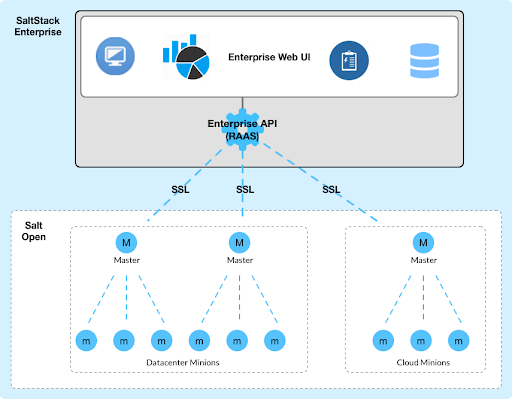
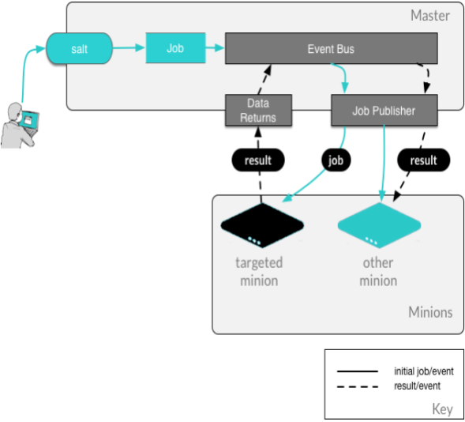

.. _salt-overview:

=======================
Salt overview
=======================

Features of Salt
=================
The Salt system is a Python-based open-source remote execution framework for
configuration management, automation, provisioning, and orchestration.

.. image:: ../_static/img/features-of-salt.png
   :align: right
   :alt: Features of Salt

Salt delivers a dynamic communication bus for infrastructure to leverage in:

* Remote execution.
* Configuration management.
* Automation and orchestration.

Salt supports the *Infrastructure as Code* approach to deployment and datacenter
management.

Remote management
-----------------

Running commands on remote systems is the core function of Salt. Salt can execute
multiple commands across thousands of systems in seconds with a single execution.

Configuration management
------------------------

The Salt configuration management system is based on storing all configuration
or "state" data inside an easily understood data structure. The concept behind
the State system is:

* **Simple** - easy to administer and manage.
* **Extensible** - easy to add custom modules, or extend existing states.
* **Deterministic** - executes in the same way every time.
* **Layerable** - provides layers of data abstraction (such as states call execution modules).

Automation and orchestration
----------------------------

Executing remote management and configuration on a minion is perfect when you
want to ensure that the minion is configured and running the way you want.
Sometimes, however, you want to configure a set of minions all at once.
For example, if you want to set up a load balancer in front of a cluster of
web servers, you can ensure the load balancer is set up first. You can then
apply the same matching configuration consistently across the whole cluster,
which is known as orchestration.

Salt management concepts
========================

A basic Salt implementation consists of a Salt master managing one or more Salt minions.

* A Salt master is a server running the ``salt-master`` service that provides
  management to many systems.
* A Salt minion is any system/device managed by Salt. A Salt minion can
  run the ``salt-minion`` service or can be agentless using ``salt-ssh``
  or ``salt-proxy``.
* A Salt Proxy process can behave as a salt-minion, which in turn connects
  to an underlying device to execute commands or states.  Salt Proxy
  connections are typically achieved via SSH or RESTful API calls.
* Systems managed via SSH with the ``salt-ssh`` model are also considered
  agentless minions under the managed systems model.
* A newer system in development is ``salt-bin``, which will.

Salt master
-----------

A server running the ``salt-master`` service is a Salt master. The Salt master
provides a cohesive platform for orchestration and automation between managed systems.

Salt minion
-----------

A system under control of the Salt master is considered a Salt minion.
However, minions do not require a master to be managed but can run in a stand-alone
mode.

* The ``salt-minion`` service runs as a management agent on a system.
* The ``salt-minion`` service can run pretty much anywhere you can have a
  Python interpreter.

Salt proxy
----------

Proxy minions are a feature that enables controlling devices that,
for whatever reason, cannot run a standard salt-minion.  A proxy minion process
is used to establish a connection to an underlying device, using methods native
to that device (SSH, Rest, etc).

Salt SSH
--------

The Salt SSH system was added to Salt as an alternative means to communicate
with minions. The Salt SSH system can be used in tandem with or as an alternative
to the standard Salt system. The Salt SSH system does not require that a Salt
minion be present on the target system. Only SSH needs to be running and port
22 open. We introduce this capability of Salt so you can appreciate the full
capability of Salt but will not be using it in this class.

SaltStack Config
----------------

SaltStack Config provides an intuitive user interface to perform complex functions
like configuration management and orchestration. Jobs in SaltStack Config can be
built, stored, and scheduled so you spend less time and fewer resources executing
routine functions. It also allows distributing the work to other skill-level
employees and teams while securing your system and guarding the environment
from the misuse of powerful tools.

SaltStack Config features include:

* A web-based user interface
* Role-based access control
* Multi-master support
* Central job and event cache
* LDAP, SAML, OIDC, & Active Directory integration
* Security policies with industry-standard compliance profiles, such as CIS and
  DISA STIGS
* Reporting
* An enterprise API (eAPI)

Salt topology
=============

Salt has two ports used by default for the minions to communicate with their
master(s). These ports work in concert to receive and deliver data to the *Message
Bus*. Salt’s message bus is ZeroMQ, which creates an asynchronous network topology
to provide the fastest communication possible.

Open event system
-----------------

The event system is used for inter-process communication between the Salt master
and Salt minions:

* Events are seen by both the master and minions.
* Events can be monitored and evaluated by both.
* The event bus lays the groundwork for orchestration and real-time monitoring.

Salt event system execution architecture
----------------------------------------

All minions see jobs and results by subscribing to events published on the event
system.
Salt uses a pluggable event system:

* **ZeroMQ (0MQ)** - the current default socket-level library providing a flexible transport layer.
* **Tornado** - full TCP-based transport layer event system.

High-speed communication bus
----------------------------

One of the greatest strengths of Salt is the speed of execution. The event system’s
communication bus is more efficient than running a higher-level web service (http).
The remote execution system is the component that all components are built
upon, allowing for decentralized remote execution to spread load across resources.

YAML Salt configuration file format
-----------------------------------

*YAML Ain't Markup Language* is a human friendly data serialization standard for
all programming languages. It is not a markup language like XML which uses tags
to "mark" text. YAML commonly focuses on data structures, such as lists and
dictionaries, not document markup.

Rules of YAML
-------------

The default renderer for many of the files used in Salt is the YAML renderer.
YAML is a markup language with many powerful features. It is the job of the YAML
renderer to take the YAML data structure and compile it into a Python data
structure for Salt.

There are basic rules for creating YAML:

* Data is structured in ``key: value`` pairs.
* Mappings use a colon and one space (“: ”) to mark key: value pairs.
* The value of keys can be in many different structures.
* All keys/properties are case-sensitive. Comments begin with a hash “#”.

YAML simple structure
---------------------

YAML consists of three basic element types:

#. **Scalars** -``key: value`` mappings where the value can be a number, string, or boolean value.
#. **Lists** - a ``key:`` followed by a list of values where each value is on a separate line and proceeded with two spaces and a hyphen.
#. **Dictionaries** - a collection of ``key: value`` mappings and lists.

.. Note::
    All keys are case sensitive.

**Scalar**

.. code-block:: YAML

     # key: value

     vegetables: peas
     fruit: apples
     grains: bread

**Lists**

.. code-block:: YAML

    # sequence_key:
    #  - value1
    #  - value2

    vegetables:
       - peas
       - carrots
    fruits:
       - apples
       - oranges

**Dictionary**

.. code-block:: YAML

    dinner:
      appetizer: shrimp cocktail
      drink: sparkling water
      entree:
        - steak
        - mashed potatoes
        - dinner roll
      dessert:
        - chocolate cake

Lists and dictionaries - YAML block structures
----------------------------------------------

* Indentation sets the context. You MUST indent your properties and list with one
  or more spaces, but two spaces is standard.
* Tabs are NOT allowed, use spaces ONLY.
* YAML is organized into block structures.
* A collection, which is a list, or dictionary block sequence, indicates each
  entry with a hyphen and a space ( “- ”).
