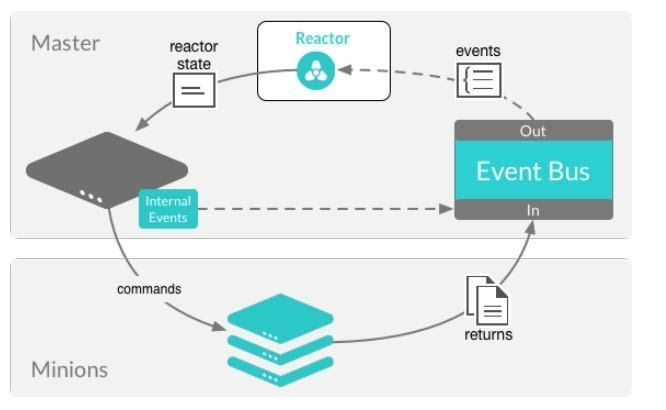
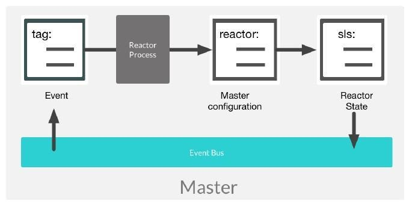

.. _reactors:

========
Reactors
========

Use case
========

The reactor system leverages the ``salt-master`` event bus to trigger Salt state responses to targeted event tags.
Reactors expand Salt’s utility with automated responses using pre-written remediation states.

er.

Reactors can be applied in a variety of scenarios:

* Infrastructure scaling
* Notifying administrators
* Restarting failed applications
* Automatic rollback

Event system
============

The Salt event system is used to fire off events on a local UNIX socket.
Salt's event system is written to integrate with existing tooling and scripts.

Events are fired on the master for a number of situations:

.. list-table::
    :widths: 20 40 150
    :header-rows: 1

    * - Event
      - Description
      - Triggering event

    * - **auth**
      - authentication event
      - Fired when a minion performs an authentication check with the master

    * - **start**
      - start event
      - Fired every time a minion connects the Salt master

    * - **key**
      - key event
      - Fired when accepting and rejecting minion keys on the Salt master. These happen as a result of actions undertaken by the ``salt-key`` command.

    * - **job**
      - job event
      - Fired related to a new job being published or when the minion is returning (ret) data for a job

    * - **presence**
      - presence event
      - Fired on regular interval about currently connected, newly connected, or recently disconnected minions (requires the ``presence_events`` setting to be enabled)

    * - **cloud**
      - cloud event
      - Fired when ``salt-cloud`` takes an action

    * - **run**
      - run event
      - Fired as a runner begins (``new``) execution or returns (``ret``).

In addition to these events, custom event tags can be created from beacons.
These event tags can then be filtered to trigger reactor states.

Beacons and reactors
====================

When both beacons and reactors are used together, you can create unique states customized to your specific needs.

However, it is possible to create an infinite loop between a reactor and a beacon.
For example, you might set up a beacon that monitors whether a file is read.
The beacon then fires a reactor to run a state, which in turn reads the file and re-fires the beacon.

To avoid infinite loops, you can set the ``disable_during_state_run`` argument.
If a state run is in progress, the beacon will not run on its regular interval until the minion has completed the state run, at which point the normal beacon interval will resume.

.. code-block:: sls
    :caption: /etc/salt/minion.d/beacons.conf

    beacons:
      inotify:
        - files:
            /etc/important_file: {}
        - disable_during_state_run: True

Master configuration
====================

Reactor SLS files and event tags should be associated in ``/etc/salt/master.d/reactor.conf`` file as a best practice.

The ``reactor`` configuration option is used to define a list of event tags that correspond to reactor SLS files:

.. code-block:: sls
    :caption: /etc/salt/master.d/reactor.conf

    reactor:
      - 'salt/minion/*/start':
        - /srv/reactor/start.sls
      - 'mycustom/app/tag':
        - /srv/reactor/mycustom.sls
      - salt/beacon/*/inotify//etc/important_file:
        - /srv/reactor/revert.sls

Reactor states
==============

The goal of a reactor file is to process a Salt event as quickly as possible, and then to optionally start a new process in response.
Reactor SLS files are syntactically Salt states, but evaluation and execution are different from regular Salt states.

.. code-block:: sls

    <identifer>:
      <interface>.<module>.<function>:
        - <argument>: <value>

.. code-block:: sls

    <identifer>:
      <interface>.<module>.<function>:
        - <argument>: <value>
        - <argument>: <value>
    ...

Matching and rendering reactor SLS files is done sequentially in a single process. For that reason, reactors should be as small and simple as possible, avoiding complex Jinja calls that slow execution or runner modules.

The worker pool is designed to handle complex and long-running processes.
So, rendering reactor SLS files must be simple and quick, and the new process started by the worker threads can be long-running.

Reactor SLS files data structures are generated on the master. YAML + Jinja templates are used by default and are passed context variables ``tag`` and ``data``.

Client interfaces
=================

The structure that is used to call methods on one of Salt’s client interfaces is described in the `Salt Python Client API <https://docs.saltproject.io/en/latest/ref/clients/index.html>`__ documentation.

The state declaration field takes a reference to the function to call in each interface.

LocalClient
___________

* ``local`` is used to call Execution modules remotely on minions.

Executing remote commands maps to the LocalClient interface, which is used by the Salt command. So, to trigger a Salt command from a reactor, prefix the call with ``local`` and then the name of the function to call.

RunnerClient
____________

* ``runner`` calls the runner modules locally on the master.

To trigger a ``salt-run``, call the state declaration field, which will start with "``runner``", followed by the runner function to call.
The reactor state function comparable to terminal command ``salt-run manage.up`` will be ``runner.manage.up``.

WheelClient
___________

* ``wheel`` calls ``wheel`` modules locally on the master.

These modules are used for managing master side files such as ``pillar_roots``, keys, and the ``salt-master`` configurations.

LocalClient module
__________________

A field starts with "``local``" to use the LocalClient subsystem.
This interface more specifically maps to the ``cmd_async`` method inside of the LocalClient class.
This means that the arguments passed are being passed to the ``cmd_async`` method to run on the targeted minions.

Reacting with an execution module is useful for actions such as restarting web servers:

.. code-block:: sls
    :caption: /srv/reactor/restart-web-farm.sls

    restart_service:
      Local.service.restart:
        - tgt: 'web*'
        - arg:
          - httpd

The ``arg`` option takes a list as they would be presented in the terminal, so the reactor state is equal to the ``service.restart`` invocation in the terminal.

.. code-block:: bash

    salt 'web*' service.restart httpd

Reacting with a data dictionary and Jinja logic results in high resolution targeting.

.. code-block:: jinja

    
    highstate_run:
      local.state.highstate:
        - tgt: {{data['id']}}
    

.. Note::

    The same data structure and compiler used for the state system is used for the reactor system. Hence the data targeting for the ``id`` evaluates successfully.

RunnerClient module
___________________

Salt runners work similarly to Salt execution modules, but execute on the Salt master itself instead of remote Salt minions.

A Salt runner can be a simple client call or a complex application. This reactor calls the ``drac`` runner to ``pxe`` boot a Dell server:

.. code-block:: sls
    :caption: /srv/reactor/pxe_boot.sls

    pxe_boot:
      runner.drac.pxe:
        - hostname: {{data['new_server']}}
        - timeout: 30
        - username: zadmin
        - password: zpass

In this example, the reactor state is calling an orchestration state from a runner:

.. code-block:: sls
    :caption: /srv/reactor/build-app.sls

    orchestrate_dev_env:
      runner.state.orch:
        - env: dev
        - mods: orch.build-app

WheelClient module
__________________

The ``wheel`` modules have a small set of options, and are highly focused on self management of the ``salt-master``.
Generally, it is best practice to manually configure and adjust the ``salt-master``.
However, there are legitimate use cases to safely automate redundant or predictable actions.

For example, a good use case in closed LAN infrastructure is to define a reactor to automatically accept a new minion’s key.

.. code-block:: jinja
    :caption: /srv/reactor/accept-key.sls

    # Aws server is sending new key -- accept this key

    
    minion_add:
      wheel.key.accept:
        - match: {{ data['id'] }}
    

Debugging the reactor
=====================

The best window into the reactor is to run the master in the foreground with logging set to ``debug``.

The output will include:

* When the master sees the event
* What the master does in response to that event
* The rendered SLS file or any errors from rendering the SLS file

Stop the master:

.. code-block:: bash

    systemctl stop salt-master

Start the master manually:

.. code-block:: bash

    salt-master -l debug

You will see information such as:

.. code-block::

    [ DEBUG ] Gathering reactors for tag salt/auth
    [ DEBUG ] Compiling reactions for tag salt/auth
    [ DEBUG ] Rendered data from file: /srv/reactor/accept_key.sls:
