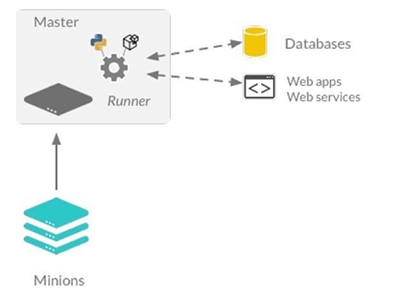

.. _runners-orchestration:

=========================
Runners and orchestration
=========================

Salt runners
============

Salt runners are convenience applications executed with the ``salt-run`` command.
Salt runners work similarly to Salt execution modules however they execute on the Salt master instead of the Salt minions.

A Salt runner can be a simple client call or a complex application.
Figure 11.1 shows how a runner can be used to communicate with 3rd party applications and allow for passing data received from minions

Runners for reporting
---------------------
Runners are particularly good for returning reports about infrastructure.
They can be used to execute a number of commands on minions, gather specific data and then output that data in a predictable way.

Runner examples
---------------
Check the status of all known minion:

.. code-block:: shell

    salt-run manage.status

.. code-block:: yaml

    down:
        - town
        - market
    up:
        - master01
        - parascope
        - awesomeweb1
        - awesomeweb2

Runners are available to create clean lists of minions:

.. code-block:: shell

    salt-run manage.down removekeys=True

The previous command will print a list of all unresponsive minions and remove their keys. This will work for targeting '*****' without worrying about minion timeouts due to down minions.

Bootstrap minions with salt-bootstrap script

.. code-block:: shell

    # Use salt-bootstrap.sh
    salt-run manage.bootstrap hosts='host1,host2'

    # Use PsExec to bootstrap Windows minions
    salt-run manage.bootstrap_psexec hosts='host1,host2'

    installer_url='https://example.com/salt-installer.exe'

Jobs runner
-----------
Since Salt executes jobs running on many systems, Salt needs to be able to manage jobs running on many systems.

The job management system is used to interact with active jobs, query active jobs, lookup executed jobs and kill running jobs.

Print a specific job’s detail given by its jid, including the return data.

.. code-block:: shell

    salt-run jobs.print_job 20190502190314793312

Salt orchestration
==================
Salt provides the ability to orchestrate system administrative tasks throughout the enterprise.

*  Orchestration can be configured across physical and cloud environments.
*  Salt fulfills these tasks through orchestration states defined in SLS files that have a different structure than Salt state files.

The scope of defining the relationship of administrative tasks to orchestrate expansion from a single host to multiple systems.

The orchestration state runner
------------------------------
The orchestration runner offers the following advantages:

*  Orchestration states can use the full suite of requisites.
*  Call execution modules and pass arguments as necessary.
*  Run states and highstates as well as using Salt Environments.
*  Execute other Salt runner modules.
*  Execute Salt states/functions using **salt-ssh**.

Executing Salt orchestration states
-----------------------------------

*  Orchestration states execute on the Salt master using the state runner module.
*  Assuming a default Salt master configuration, the following commands are equivalent:

.. code-block:: shell

    salt-run state.orchestrate orch.deploy-webapps
    - or use the alias to orchestrate -
    salt-run state.orch orch.deploy-webapps

The previous example assumes there is a subdirectory in the **file_roots** named ``orch`` and contains an orchestration state file: ``deploy-webapps.sls``

Orchestration state syntax
--------------------------

Orchestration SLS files have a slightly different structure compared to state SLS files:

*  Orchestration states use mapped command interfaces:
*  *  salt.function: Calls remote execution modules on minions.
*  *  salt.state: Call states/highstates directly.
*  *  salt.runner: Call Salt runner modules on the Salt master.
*  *  salt.wheel: Call the Salt wheel interface for Salt minion key administration.

Orchestration states can call any combination of the above command interfaces. This means that an execution can be called, followed by a runner, and then apply highstate.

Orchestration states that use the :code:`salt.function` or :code:`salt.state` interface include an extra set of parameters to define targeting:

*  tgt: Targeting parameter for the **function** or **state/highstate**. This item can be any of the currently supported targeting types
*  tgt_type: If minion ID globbing is NOT used in the **tgt** parameter, then this option must define the supported targeting type used

Orchestration state structure
-----------------------------
An orchestration state will have the following structure:

.. code-block:: sls

    # skeleton structure for "salt.function"
    id_declaration_function:
      salt.function:
        - name: exec_module.function
        - tgt: 'your-targets'
        - tgt_type: 'type-of-targeting'

    # skeleton structure for "salt.state"
    id_declaration_states:
      salt.state:
        - tgt: 'your-targets'
        - tgt_type: 'type-of-targeting'
        - sls:
          - path1.state1
          - path1.state2
          - path2.state1

    id_declaration_highstate:
      salt.state:
        - tgt: 'your-targets'
        - tgt_type: 'type-of-targeting'
        - highstate: True

    # skeleton structure for "salt.state"
    id_declaration_runner:
      salt.runner:
        - name: runner_module.function

Orchestration examples
----------------------
Calling states and functions:

.. code-block:: sls
   :caption: /srv/salt/orch/deploy-webapps.sls

    reconfig_load_balancers:
      salt.state:
        - tgt: 'proxy*'
        - sls:
          - haproxy-pool

    extract_war:
      salt.function:
        - name: cmd.run
        - tgt: 'javasrv01'
        - arg:
          - jar xf /opt/biz/myproject.war -C /opt/tomcat/webapps
        - require:
          - salt: reconfig_load_balancers

A more complex example. Consider the following individual cli commands:

.. code-block:: shell

    salt \* state.apply core
    salt -E '^(web|app).*' state.highstate
    salt -G 'role:firewall' junos.ping
    salt -G 'role:firewall' state.apply firewall.web_rules pillar='{"rule_group":"web_app"}'
    salt-run http.query 'https://example.com/update/web_app' method=POST data='<xml>somedata</xml>'

A Salt orchestration state file could be defined to run these commands:

.. code-block:: sls
   :caption: /srv/salt/orch/deploy_web

    apply_core:
      salt.state:
        - tgt: '*'
        - sls:
            - core

    web_highstate:
      salt.state:
        - tgt: '^(web|app).*'
        - tgt_type: pcre
        - highstate: True
        - require:
            - salt: apply_core

    test_fw:
      salt.function:
        - name: junos.ping
        - tgt: 'role:firewall'
        - tgt_type: grain

    deploy_web_rules:
      salt.state:
        - tgt: 'role:firewall'
        - tgt_type: grain
        - sls:
            - firewall.web_rules
        - pillar:
            - rule_group: {{ pillar.get['rule_group'] }}
        - require:
            - salt: test_fw
        - onchanges:
            - salt: web_highstate

    update_devops:
      salt.runner:
        - name: http.query
        - arg:
            - 'https://example.comf/update/web_app'
        - kwarg:
            method: POST
            data: '<xml>somedata</xml>'
        - require:
            - salt: deploy_web_rules

To execute the orchestration state:

.. code-block:: shell

    salt-run state.orch orch.deploy_web pillar='{"rule_group":"web_app"}'

.. Note::
    Notice we can also pass in Pillar data via the command line in order to pass along to executions as well as utilize the full set of requisites.

Another example to allow new minions to join to the Salt master and initiate a highstate:

.. code-block:: sls
   :caption: /srv/salt/orch/new_minion.sls

    

    
    minion_add:
      salt.wheel:
        - name: key.accept
        - match: {{ minion_id }}

    pause_flow:
      salt.runner:
        - name: test.sleep
        - s_time: 5
        - require:
          - salt: minion_add

    deploy_highstate:
      salt.state:
        - tgt: {{ minion_id }}
        - highstate: True
        - require:
            - salt: minion_add

    
    need_minion:
      test.fail_without_changes:
        - name: The required 'minion_id' value was not passed via Pillar
    
