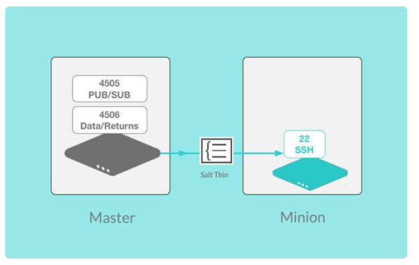

.. _salt-ssh:

========
Salt SSH
========

Managing systems with Salt SSH
==============================

Salt SSH was added in Salt as an alternative means to communicate with minions.
The Salt SSH system can be used in tandem with or as an alternative to the standard Salt system.

The Salt SSH system does not supersede the standard Salt communication systems. It simply offers an SSH-based alternative that does not require a remote agent.

Be aware that since all communication with Salt SSH is executed via the SSH protocol, it is substantially slower than the standard Salt master-minion model.

Salt SSH concepts
_________________

Salt SSH requires a few things to be setup on the remote system in order for Salt SSH to be able to manage it:

* Python is required on the remote system (unless using the ``-r`` option to send raw ssh commands)
* The SSH service must be running on the remote system
* Network/Firewall must be available/open to remote system

Salt SSH creates a tar-ball containing a system referred to internally to Salt as **Salt Thin**.
Salt SSH keeps track of the deployed version of Salt Thin on target systems and will update minions dynamically.

Install Salt SSH
________________

Salt SSH is installed on the Salt Master as a Linux package:

.. code-block:: bash

   salt-call pkg.install salt-ssh

No installation is necessary on the managed system. It just needs to have SSH enabled.

Configuring the Salt SSH roster
===============================

Configuring Salt SSH to access remote systems requires a Salt SSH roster file.

Roster file
___________

Each system to manage Salt SSH must have an entry defined in the Salt SSH roster file. The roster is defined as a regular Salt configuration file. The default location for the roster file is :file:`/etc/salt/roster`.

The file is rendered using the Salt render system and can therefore be written in YAML, JSON, Python, etc. as well as contain Jinja templating.
Roster file format:

.. code-block:: yaml

    <minion ID>:    # The ID to reference the target system
      host:         # The IP or DNS name of the remote host
      user:         # The user to login as (unless the same as user
                    # issuing salt-ssh command)

      passwd:       # The password for the login user
      port:         # Port the target system is listening for SSH
      sudo:         # Boolean to run commands via sudo, default:
                    # False
                    # sudo only works if NOPASSWD is set for user
                    # in /etc/sudoers: fred ALL=(ALL) NOPASSWD: ALL

      tty:          # Boolean: Set this option to True if sudo is
                    # also set to True and requiretty is also set on
                    # the target system

      priv:         # File path to ssh private key
      priv_passwd:  # Passphrase for ssh private key
      timeout:      # Number of seconds to wait for response when
                    # establishing an SSH connection

      minion_opts:  # Dictionary of minion opts
      thin_dir:     # The target system's storage directory for Salt
                    # components. Defaults to /var/tmp/salt-<hash>.

      cmd_umask:    # umask to enforce the salt-call command.
                    # Should be in octal (so for 0o077 in YAML you
                    # would do 0077, or 63)

The ``roster_defaults`` can be defined in the master config to set the default login variables for targets in the *roster* so that the same arguments do not need to be defined or passed with command line arguments.

.. code-block:: sls
    :caption: /etc/salt/roster

    roster_defaults:
      user: tom
      sudo: True
      priv: /root/.ssh/id_rsa
      tty:  True

Example roster:

.. vale off

.. code-block:: sls
    :caption: /etc/salt/roster

    web1: 192.0.2.1    # Use the roster_defaults (or current user) info

    web2:
      user: dave
      passwd: Salt4Me!
      host: 192.0.2.2
      port: 2222
      sudo: True
      minion_opts:
        retry_dns: 30
        module_dirs:
          - /opt/lib/salt/modules
          - /mnt/other/salt/modules

    web3:
      host: 198.51.100.103
      priv: /etc/salt/trusted-admin.pem
    web4:
      host: 198.51.100.104
      priv: /etc/salt/trusted-admin.pem

.. vale on

Deploying a Salt SSH key
________________________

By default, salt-ssh will generate key pairs for ssh, the default path will be ``/etc/salt/pki/master/ssh/salt-ssh.rsa``

You can use ``ssh-copy-id``, (the OpenSSH key deployment tool) to deploy keys to your servers.

.. code-block:: bash

    ssh-copy-id -i /etc/salt/pki/master/salt-ssh.rsa.pub tom@srv1.domain.com

Calling salt-ssh
================

Calling Salt SSH is meant to be simple. The command line has been made to mimic the ``salt`` command with a target, function and arguments in the same way.

Examples of salt-ssh
____________________

A simple example using ``test.ping`` for all Salt SSH minions:

.. code-block:: bash

    salt-ssh \* test.ping

The ``-i`` option approves the host key on the remote system(s) and prevents manual acceptance of each key:

.. code-block:: bash

    salt-ssh -i 'web*' network.interfaces

The ``salt-ssh`` command line can use alternate targeting (RegEx):

.. code-block:: bash

    salt-ssh -E 'web[1-5]' status.uptime

Apply Salt States using ``salt-ssh``:

.. code-block:: bash

    salt-ssh 'web*' state.sls httpd

Run raw shell commands using ``salt-ssh``:

.. code-block:: bash

    $ salt-ssh 'web*' -r 'rm -rf /tmp/*'

.. Note::

    Python is not required when using the ``-r`` option to send raw commands. This can be useful to connect/test non-\*nix system.

Scan the Salt SSH roster
________________________

The scan roster uses a simple port scanning algorithm to scan for an open ssh port on a remote system or on an entire subnet.

Then ``salt-ssh`` will attempt to execute the given routine on all found systems.

.. code-block:: bash

    salt-ssh --roster scan 198.51.100.104 test.ping

.. code-block:: bash

    salt-ssh --roster scan 192.0.2.0/24 test.ping
