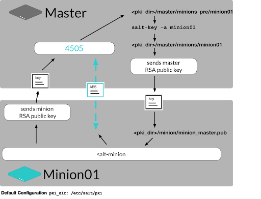

.. _security:

=============
Salt security
=============

More about keys
===============

This section provides more information about Salt key management.

Concepts about salt-key
_______________________

* When a minion checks into the master it sends its public key to the master and the master checks if the key has been accepted.
* The minion will attempt to re-authenticate every 30 seconds until it’s key is accepted.
* If accepted then the master will accept the minion and allow it to accept commands.
* After the keys are sent to the master then the master will need to accept them. This acceptance is done with the salt-key command. Salt keys are used in the following ways:
* RSA keys are used for authentication
* An AES key is used for encryption

  * The AES key is changed every 24 hours by default, or when a minion is deleted.

Salt key management concepts
____________________________

The following diagram shows more detail in how Salt manages keys.

Salt minion sends its public key to the Salt master.

* The minion public and private keys are stored on the minion by default as

  * ``/etc/salt/pki/minion/minion.pem``
  * ``/etc/salt/pki/minion/minion.pub``

* The key is stored in the

  * ``/etc/salt/pki/master/minions_pre`` directory.

* The key has the name of the minion that presented it.

.. Note::

    If you change the id of the minion then you need to rename it’s key on the master.

The key is then examined, compared and explicitly accepted by an administrator.

* Once the key is accepted by the administrator then it is moved to the ``/etc/salt/pki/master/minions`` directory.
* If the administrator rejects the key then it is placed in the ``/etc/salt/pki/master/minions_rejected`` directory.

After the Salt minion key is accepted, the Salt master returns its public key to the Salt minion.

* The master’s public key is stored on the minion as: ``/etc/salt/pki/minion/minion_master.pub``

The master also sends a rotating AES key that is used to encrypt and decrypt messages sent by the Salt master.

* The AES key will be changed for all minions daily and in the event that another minion’s key is deleted or rejected.
* The default master configuration setting is set to True you can disable ASE key rotation by setting:

.. code-block::
    :caption: /etc/salt/master.d/keys.conf

    rotate_aes_key: True

More about keys
_______________

The returned AES key is encrypted using the public key initially sent by the Salt minion, and can therefore be decrypted only by the same Salt minion.

* When watching authentication, by watching events, or running with a debug level of the daemon in the foreground you will see that minions are authenticated frequently with RSA keys, but know that those are used to roll the AES keys.

.. Note::

    All minions share the same AES key except for pillar data. A specific AES session key is negotiated on a per-minion basis when pillar data is transmitted.

Printing key information
________________________

Before accepting new keys, the wise action is to first verify that the key that is being accepted is the actual public key which resides on the minion. The salt-key command can print out the public key so that it can be verified against the minion easily

The public key can be viewed using salt-key:

.. code-block:: bash

    salt-key -p db1

.. code-block:: bash

    salt-key -p db1 command output

    -----BEGIN PUBLIC KEY-----
    MIICIDANBgkqhkiG9w0BAQEFAAOCAg0AMIICCAKCAgEAtG1wZunomT4oPGiLDXeUqJkjqLJLk9P
    JgVPrJal5FdbpDAdTVC5na7wnfTw5SxUTPijUzGqoFktSCS+7iwho4IdAmNLlR/Zen9OYvAG9ZE
    xtyOSrKqTPZNguqT8BVXEpI1HHIRHXsJAu4GGap//CXMFTm8Q18BnI0TA2NuugGyn9wu8lngOXT
    E2bX49QJ9pxxSR7zhqOkTl26nVhiBm8/mz4On9XD246S/I0pPMM1QUH/yymv/aLd+y/b24uvrwW
    fvR79zfR2hCr038gLxssGesaFCzygjy0djGeS5pnc0Jsc+HiJ/zv66fvNzQqmpLbRUsnK5Eanoj
    KP89wWvr9Fe4TjMcbNKR83g6Yrdz+9Bc2JOgpd4nd7uillJmR8QrZtDVGpOHX96A/P7WHoaFlkl
    0OZtB0eWqUM5L4ANo1BTlG9jNKHZpxiRd9R0HFhFbc+dj5KHo9wS1BSgXfsYgikyMSNTEdYZU/F
    afE9YqyFCtp5U6biGBMjKtS6SkOlZwG1Xoys6WAr77EG4DuPCFnnX1eAgDvL0y+um+iqPzBYyCI
    o9MOfOYe7HGR9CfZUPLJqgxMapur8Pevihww/2rqyQ2f/wmzdpdH51JJXmch9PxUAxpG9nbEsSx
    6XXNKfIOr40cAdhemPyCazh669u+s0D4lozmIGUToVpXSh0zvB0kCAQE=
    -----END PUBLIC KEY-----

Similarly all minion public keys can be printed with the ``-P`` flag:

.. code-block:: bash

    salt-key -P

.. code-block:: bash

    salt-key -P command output

    Unaccepted keys:
    Accepted keys:
    web1
    -----BEGIN PUBLIC KEY-----
    MIICIDANBgkqhkiG9w0BAQEFAAOCAg0AMIICCAKCAgEAtG1wZunomT4oPGiLDXeUqJkjqLJLk9PJg
    VPrJal5FdbpDAdTVC5na7wnfTw5SxUTPijUzGqoFktSCS+7iwho4IdAmNLlR/Zen9OYvAG9ZExtyO
    SrKqTPZNguqT8BVXEpI1HHIRHXsJAu4GGap//C
    ...

Printing key signatures
_______________________

Key signatures can be printed out with the -F finger flag for all minions or ``-f`` for an individual minion:

.. code-block:: bash

    salt-key -f db1

.. code-block:: bash

    salt-key -f db1 command output
    Signature for db1 public key: c1:2d:2b:11:73:d5:e5:63:93:df:a8:d7:e2:a2:eb:6b

Get the public signature for your local master:

.. code-block:: bash

    salt-key -f master

.. code-block:: bash

    salt-key -f master command output

    Signature for master public key: bc:9d:a8:89:f7:b6:fa:fe:50:c3:35:65:c1:1e:db:9b

The pki_dir
===========

All of the authentication keys are stored within the ``pki_dir``.

* The ``pki_dir`` is a configurable directory which defaults to ``/etc/salt/pki/minion/``.
* The ``pki_dir`` contains a number of subdirectories and items. On the minion the ``pki_dir`` will house the minion public key and private key.
* On the master the ``pki_dir`` will house the master key pair and three directories: ``minions``, ``minions_pre``, and ``minions_rejected``.
* The minions directory contains the accepted minion keys, the ``minions_pre`` directory contains the keys pending acceptance and the ``minions_rejected`` directory contains the keys which have been rejected.
* It is noteworthy that, keys in these directories can be manually moved from one directory to another on the master which makes manually accepting, rejecting or removing keys very flexible.

Increasing security
===================

After a minion sends its public key to the master, and receives the master’s public key in return, it can safely assume a secure connection to the master so long as the master’s keys do not change.

* It may be desirable for the minion to authenticate the master even before the initial key exchange occurs.
* The ``master_finger`` option can be used by the minion to pre-validate the master.

Once the master’s key fingerprint has been determined with the ``salt-key -F`` command, it can be set in the minion’s configuration:

.. code-block::
    :caption: /etc/salt/minion.d/master.conf

    master_finger: ec:81:7c:f1:8d:cf:2a:f6:a3:af:76:cd:5f:be:aa:73

* Salt uses RSA key based authentication, the public keys of minions attaching to a master are sent to the master and cached.
* By default the keys await manual acceptance from the admin.
* The minion authenticates the master server to prevent man-in-the-middle attacks from rogue Salt masters.
* This means that if the master key changes, the minion will not accept any connections.
* Encrypted communication between the master and minion cannot be disabled.

Decreasing security
===================

Certain factors in a deployment may require options that result in decreased security posture.

The auto_accept option
______________________

* The ``auto_accept`` option can be set to True to make all incoming keys get accepted.
* If an incoming key conflicts with an existing key, then it will be denied.

.. warning::

    It is generally not advised to use the ``auto_accept`` option unless operating in a safe test environment or on a closed network.

.. code-block::
    :caption: /etc/salt/master.d/keys.conf

    auto_accept: True

The open_mode option
____________________

* Conflicting minions with key denial behavior can be overwritten with the ``auto_accept`` and ``open_mode`` options.
* The ``open_mode`` option will set the Master to accept all keys it is presented with, regardless of conflicts or if the keys have been previously set as rejected.
* ``open_mode`` is designed to make running Salt in a test environment easy, or for when authentication is not a concern.

.. warning::

    This means that running in ``open_mode`` should only be considered if the master is in an isolated or temporary test environment (the Salt integration tests run in open mode), or the Salt master is in the isolated bunker of a military installation.

.. code-block::
    :caption: /etc/salt/master.d/keys.conf

    open_mode: True

Publisher ACLs
==============

The salt publisher ACL system is a means to allow system users other than root to have access to execute select salt commands on minions from the master. The publisher ACL system allows for a command whitelist in the master configuration file via the ``publisher_acl`` configuration option. The ``publisher_acl_blacklist`` option operates by allowing all functions except those that are blacklisted. Users listed under this option are given access to run specific modules on specific minions using regular expressions.

.. Note::

    The ``client_acl`` and ``client_acl_blacklist`` options are deprecated.

Publisher ACL example
_____________________

Allow the user tom on the server running the Salt master the capability to run any execution module. User seth is limited to running any function in the test module and the network. interfaces function on just servers starting with ns.

.. code-block:: sls
    :caption: /etc/salt/master.d/user.conf

    publisher_acl:
      engineer:   # Allow engineer full execution access
        - .*
      admin:      # Limit admin select execution access
        - ns*:
        - test.*
        - network.ip_addrs

After logging in as user admin on the server running the Salt master:

.. code-block:: bash

    su admin

.. code-block:: bash

    salt \* test.ping minion1: True minion2: True

.. code-block:: bash

    salt \* network.ip_addrs {'minion1': ['192.0.2.172']} {'minion2': ['198.51.100.1', '192.0.2.39', '192.0.2.21']}

.. code-block:: bash

    salt \* pkg.install bind

.. code-block:: bash

    salt \* pkg.install bind command output

    'Failed to authenticate, is this user permitted to execute commands?'

Publisher blacklist example
___________________________

Blacklist any of the following users or modules is done with the ``publisher_acl_blacklist`` option. This example would blacklist all non-sudo users from running any commands. It would also blacklist any use of the "cmd" module.

.. code-block:: sls
    :caption: /etc/salt/master.d/user.conf

    publisher_acl_blacklist:
      users:
        - root
      '^(?!sudo_).*$':   # all non sudo users
        - cmd

Filesystem permission changes
_____________________________

Running as a non-root user requires some permission changes:

Set chmod 755 on:

* ``/var/cache/salt``
* ``/var/cache/salt/master``
* ``/var/cache/salt/master/jobs``
* ``/var/run/salt``
* ``/var/run/salt/master``
* ``/var/log/salt``

Set chmod 777 on:

* ``/var/log/salt/master``

External authentication system
==============================

The new external authentication system allows for Salt to pass through authentication to any authentication system to determine if a user has permission to execute a Salt command. The Unix PAM system and LDAP are the first supported systems with more to follow. The external authentication system allows for specific users to be granted access to execute specific functions on specific minions.

Defining external authentication
________________________________

Salt’s External Authentication System (eAuth) allows for Salt to pass through command authorization to any external authentication system, such as PAM or LDAP. The PAM module does not allow authenticating as root. External authentication allows control over execution, runner, and wheel modules and interfaces. External authentication provides support for groups declared with the % appended to the name. Execution modules allow for control by minion.

.. code-block:: sls

    # examples of external authentication definitions
    external_auth:
    auth_module:	            # the authentication system
      some_user_or_group%:	    # a user or group given access
        'some_host':	        # a minion matching expressing
          - exec_mod.function   # access a specific function
          - exec_mod.*	        # access to all module functions
          - exec_mod.*	        # all access a specific function
          - '@wheel'	        # access to all wheel modules
          - '@runner'	        # access to all runner modules
          - '@jobs'             # access to the jobs runner and/or wheel module

LDAP external authentication
____________________________

Salt supports both user and group authentication for LDAP (and Active Directory accessed via its LDAP interface) There are two phases to LDAP authentication.

#. Salt authenticates to search for a user’s Distinguished Name and group membership. The user it authenticates as in this phase is often a special LDAP system user with read-only access to the LDAP directory.
#. After Salt searches the directory to determine the actual user’s DN and groups, itre-authenticates as the user running the Salt commands. LDAP configuration happens in the Salt master configuration file. Here is an example configuration of LDAP authentication:

.. code-block::
    :caption: /etc/salt/master.d/authorized.conf

    auth.ldap.server: ldap1.ss.com
    auth.ldap.port: 389
    auth.ldap.tls: False
    auth.ldap.scope: 2
    auth.ldap.uri: ''
    auth.ldap.tls: False
    auth.ldap.no_verify: False
    auth.ldap.anonymous: False
    auth.ldap.groupou: 'Groups'
    auth.ldap.groupclass: 'posixGroup'
    auth.ldap.accountattributename: 'memberUid'

    # LDAP proxy account
    auth.ldap.basedn: dc=ss,dc=com
    auth.ldap.binddn: cn=proxy,dc=ss,dc=com
    auth.ldap.bindpw: p@ssw0rd

    # These are only for Active Directory
    auth.ldap.activedirectory: True
    auth.ldap.persontype: 'person'

External authentication example
_______________________________

This example allows for the seth user to run a functions in the network, dig, and test modules on DNS servers matching the expression of ns*.example.com.
The second example allows the dns-admins group, indicated with a % the capability to run network.interface and any of the test module commands on any minion whose name matches the glob ’web*’.

.. code-block:: sls
    :caption: /etc/salt/master.d/user.conf

    external_auth:
      ldap:
        admin:
        'ns*.example.com':
            - network.*
            - dig.*
            - test.*
        dns-admins%:
        'ns*':
            - network.interfaces
            - test.*

Using external authentication
_____________________________

Once enabled, external authentication can be used passing
``-a <authentication system>`` at the command-line:

.. code-block:: bash

    salt -a auto ns01.example.com network.ipaddrs eth0

.. code-block:: bash

    salt -a auto ns01.example.com network.ipaddrs eth0 command output

    username: admin
    password: *****
    ns01.example.com:
      - 203.0.113.1

Hardening Salt
==============

How you best secure and harden your Salt environment depends heavily on how you use Salt, where you use Salt, how your team is structured, where you get data from, and what kinds of access (internal and external) you require.

General hardening tips
______________________

* Restrict who can directly log into your Salt master system.
* Use SSH keys secured with a passphrase to gain access to the Salt master system.
* Track and secure SSH keys and any other login credentials you and your team need to gain access to the Salt master system.
* Use a hardened bastion server or a VPN to restrict direct access to the Salt master from the Internet.
* Don’t expose the Salt master any more than what is required.
* Harden the system as you would with any high-priority target.
* Keep the system patched and up-to-date.
* Use tight firewall rules.

Salt hardening tips
___________________

* Subscribe to salt-users or salt-announce so you know when new Salt releases are available. Keep your systems up-to-date with the latest patches.
* Use Salt’s Client ACL system to avoid having to give out root access in order to run Salt commands.
* Use Salt’s Client ACL system to restrict which users can run what commands.
* Use external Pillar to pull data into Salt from external sources so that non-sysadmins (other teams, junior admins, developers, etc) can provide configuration data without needing access to the Salt master.
* Make heavy use of SLS files that are version-controlled and go through a peer review/code-review process before they’re deployed and run in production. This is good advice even for "one-off" CLI commands because it helps mitigate typos and mistakes.
* Use salt-api, SSL, and restrict authentication with the external auth system if you need to expose your Salt master to external services.
* Make use of Salt’s event system and reactor to allow minions to signal the Salt master without requiring direct access.
* Run the salt-master daemon as non-root.
* Disable which modules are loaded onto minions with the disable_modules setting. (for example, disable the cmd module if it makes sense in your environment.)
* Look through the fully commented sample master and minion config files. There are many options for securing an installation.
* Run masterless-mode minions on particularly sensitive minions. There is also Salt SSH or the modules.sudo if you need to further restrict a minion.
