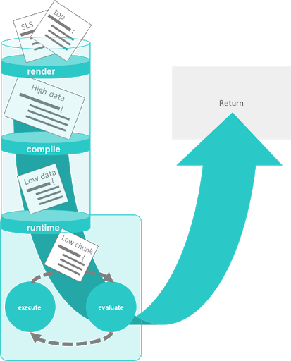
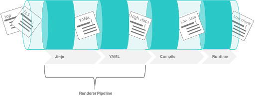
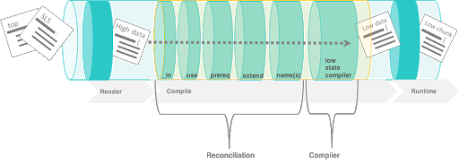
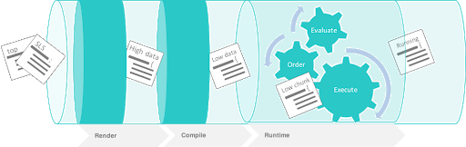
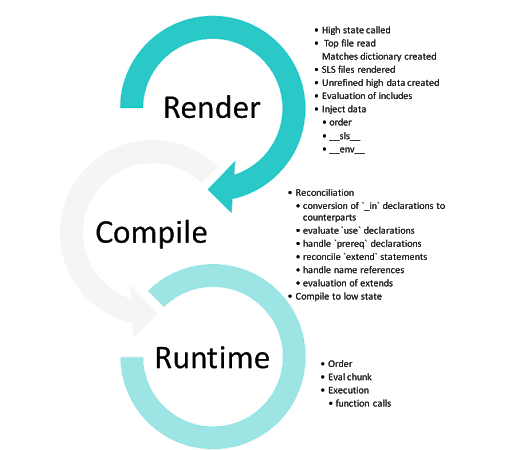

.. _state-system:

==============================
State system behind the scenes
==============================

Salt state processing
=====================

Looking into the processing of Salt state files we see that:

* The Salt state system is composed of stages.
* Execution of a state runs through a series of stages.
* The stages provide levels of abstraction.
* The State system inside Salt is fundamentally data-driven.
* Each stage has a corresponding process for refining the initial data structure.

The stages and data layers of the Salt state system are shown in the following image:

low chunk which is then evaulted and executed. Ultimately, the results are returned.

Stages of Salt state execution
______________________________

In the Salt state system, there are three distinct stages of execution:

* the render
* the compile
* the runtime

Each stage manipulates the data in a way that allows for the states to be expressed dynamically . The entire process converts of all of the data down into a single pass static data structure.

State rendering
===============

The render time is when the renderer engines are used. The top file and SLS files are converted into raw, unrefined high data. The process of state execution begins with the execution of a high state.

High state
__________

Calling SLS directly logically assigns what states should be executed from the context of the calling minion. The Highstate layer is used to allow for full contextual assignment of what is to be executed tied to one or more minions from the master.

This means that the environment of a minion, and all associated execution data pertinent to said minion, can be assigned from the master without needing to execute or configure anything on the target minion. This also means that the minion can independently retrieve information about its complete configuration from the master.

The top file
____________

In Salt, the file which contains a mapping between groups of machines on a network and the configuration roles that should be applied to them is called a top file.

Top files are downloaded from the master.

* The top files from each environment are downloaded and passed through the render interface.
* The top files are rendered. Top files can be processed by multiple renderers such as Jinja and YAML renderers.

The ``master_tops`` function is called.

* This function requests the master tops plugin interface from the master.
* The master evaluates all configured master tops plugin interfaces.

This pluggable interface allows for storing top file information in a database or via a provisioning tool. The top file routine generates the first data structure needed to kick off the state process.

Match evaluation
________________

The matches dictionary contains all of the needed data to start gathering SLS references. A raw matches dictionary will be a variation of this format:

.. code-block:: Python

    {'base': ['dns', 'dns.bind-utils','core', 'httpd', 'edit']}

.. Note::

    When calling ``state.sls`` the matches dictionary is generated from the SLS references s and the environment name sent as arguments to the function.

SLS rendering and templating
____________________________

#. Each SLS file is rendered and the “raw” high data of that individual file is returned. The default renderers are the Jinja + YAML (yaml_jinja) renderers.
#. The templates in the file rendering sequence are all executed at this point. This means that all references to Salt functions are resolved now, before any execution of states begin.
#. As the SLS references are downloaded and rendered, their respective data is combined into a single Python dictionary which will be further processed.

The following image shows where rendering happens in the state execution process:

Rendering pipeline in the stages of state execution. This example shows the data conversion of a state when rendered and templated.

The following state fragment is written in YAML with a Jinja template expression to get the ``os_family`` grain:

.. code-block:: sls

    named_conf:
      file.managed:
        - source: salt://dns/files/{{grains['os_family']}}-named.conf
        - name: /etc/named.conf

If the following state is rendered on a RedHat minion then it will be converted to:

.. code-block:: sls

    named_conf:
      file.managed:
        - source: salt://dns/files/RedHat-named.conf
        - name: /etc/named.conf

High data
_________

High data is the data structure represented in YAML via SLS files. The High data structure is created by merging the data components rendered inside SLS files (or other render systems).

The High data can be easily viewed by executing the ``state.show_highstate`` or ``state.show_sls`` functions. Since this is a somewhat complex data structure, it may be easier to read using the ``json``, ``yaml``, or ``pprint`` outputters:

.. code-block:: bash

    salt '*' state.show_highstate --out yaml

    salt '*' state.show_sls edit.vim --out pprint

Evaluation of ``include`` statements
____________________________________

If a single SLS file contains an ``include`` declaration, then the included SLS references need to be rendered. For each rendered SLS file with includes, the list of includes is read and the SLS references defined are resolved.

This is the point where include statement globs are reconciled.

* This means that the referenced includes are downloaded and rendered as they are found.
* The render sequence maintains which SLS references have already been downloaded ensuring that the same SLS file is not rendered twice.

Injected data
_____________

At a number of points in the compiler, data is injected into the structures for ordering and tracking needs. These injections enable many features of the runtime and are used to help pass the correct debug data up the chain.

Injected state auto order
_________________________

While the order flag is inserted here, it has not been evaluated yet, which happens when the high data is compiled to low data.
The YAML renderer has been modified to use ordered dictionaries instead of standard unordered dictionaries.

* This means that as the files are rendered that the order is preserved and order flags can be inserted into the state declarations.
* The order of the automatic state ordering is started at the tail-end of the ``include`` statement.
* Therefore, the first SLS file to get pushed into the high data dictionary is the first to get ordered.
* More simply put, the order is first declared at the end of the include chain.
* So, if SLS file 'a' includes file 'b', which includes file 'c', then the states in 'c' will be the first to be evaluated, then 'b' then 'a'.

If the order is declared then it is honored, otherwise, a value is injected:

.. code-block:: sls

    named_conf:
      file.managed:
        - name: /etc/named.conf
        - order: 10002  # <- order injected

    start_bind:
      service.running:
        - name: named
        - order: last  # <- explicitly declared, not evaluated till later

Injected ``__sls__`` and ``__env__`` values
___________________________________________

The SLS reference to the loaded file and the environment that file came from are both loaded into the state declarations at this point. These keys are called:

* ``__sls__`` for the SLS reference
* ``__env__`` for the environment

These values are read in by a number of states to ensure that the same environments are used to download source files as the SLS file was retrieved from:

.. code-block:: sls

    named_conf:
      __env__: base # <- injected
      __sls__: dns  # <- injected
      file.managed:
        - source: salt://dns/files/RedHat-named.conf
        - name: /etc/named.conf
        - order: 10002

    Start_bind:
      __env__: base  # <- injected
      __sls__: dns   # <- injected
      service.running:
        - name: named
        - order: last

Stashing ``extend`` and ``exclude`` statements
______________________________________________

All ``extend`` and ``exclude`` statements are, at the time of each file being rendered, stashed into high-level data structures:

* ``__extend__`` for extended states
* ``__exclude__`` for excluded states

These structures maintain this data to be reconciled once all SLS references have been rendered. This means that all “top level” declarations are pulled out and combined during the initial rendering of the file.

Unrefined data
______________

Once all of the SLS references have been rendered, the resulting data structure is the unrefined high data. The unrefined high data needs to be refined, reconciled, and then compiled.

The data structure shortcuts are cleaned up and the standard high data is made ready. This includes taking care of “short decs”, or dot delimited references. This cleanup changes all references that look like these:

.. code-block:: sls

    named_conf:
      __env__: base
      __sls__: dns
      file.managed:
        - source: salt://dns/files/RedHat-named.conf
        - name: /etc/named.conf
        - order: 10002

    start_bind:
      __env__: base
      __sls__: dns
      service.running:
        - name: named
        - order: last

Into structures that have removed the dot-delimited short decs:

.. code-block:: sls

    named_conf:
      __env__: base
      __sls__: dns
      file:
        - managed  # <- function moved here
        - source: salt://dns/files/RedHat-named.conf
        - name: /etc/named.conf
        - order: 10002

    start_bind:
      __env__: base
      __sls__: dns
      service:
        - running  # <- function moved here
        - name: named
        - order: last

All exclude top level declarations are now evaluated.

State compile
=============

* The data is read for exclude matches and the respective excludes are pulled out.
* The main caveat to executing the excludes at this point is that this evaluation is after the includes.
* The result is that when states included from one file and excluded from another, the exclude will override the include.

State compile
_____________

Now that the state has been rendered it is ready to compile. The Salt state compiler consists of the reconciliation of complex raw high data structures:

* conversion of ``_in`` declarations to counterparts
* evaluate ``use`` declarations
* handle ``prereq`` declarations
* reconcile ``extend`` statements
* handle ``name`` references
* compile to low data (low chunks)

The following image shows state compiler routines

Reconciliation
______________

State reconciliation includes:

* Reconcile complex raw high data
* Convert ``requisite_in`` declarations to requisites
* Use reconciliation
* Prereq fork reconciliation
* Handling ``extend``

Reconcile ``requisite_in`` statements
_____________________________________

The raw high data is scanned for ``requisite_in`` statements. The ``requisite_in`` statements that are found become transformed into data in the ``__extend__`` structure to be evaluated next.

* An example of a ``requisite_in`` is ``require_in`` or ``watch_in``
* The ``require_in`` and ``watch_in`` requisites are the simplest.
* These convert into extended data that applies the respective ``require`` and ``watch`` statements.
* The use and ``use_in`` requisites search through the high data for the redirected data and set the extended dictionary to apply the variables that will be used.

Reconcile ``prereq`` statements
_______________________________

The ``prereq`` system creates a fork.

* The problem is that ``prereq`` needs to apply a requisite to the thing which it requires while also soft requiring it.
* The ``prereq`` system therefore creates what is a recursive loop of requisites with an exit condition.
* The ``prereq`` sets all states which are pre-required with the pre-required requisite, while maintaining the prereq requisite.
* Other ``requisite_in``s dispose of the ``requisite_in`` statement because they are no longer needed, but the ``prereq`` statement is used in the runtime.

Reconcile ``extend`` statements
_______________________________

The ``extend`` statements are now reconciled.

State Compile
_____________

* The ``extend`` and ``requisite_in`` statements have now populated the ``__extend__`` dictionary in the raw high data.
* Each key in the ``__extend__`` dictionary is now evaluated and lined up with the respective dictionary key in the raw high data.
* The ``extend`` statements are then used to modify the raw high data.
* With the ``extend`` system executed, the refined high data is ready to be compiled into low data.

Compile to Low Data
___________________

The compile stage is one of the terse stages in the runtime. The actual compile code is less than 60 lines long. This stage converts the high data structure into the low data structure by tearing out each state declaration and applying it to individual dictionaries in a list.

Low data
________

The Low State layer is the list of low chunks "evaluated" in order. To see what the low state looks like for a highstate, run:

.. code-block:: bash

    salt '*' state.show_lowstate

This will display the raw low state in the order in which each low chunk will be evaluated. The order of evaluation is not necessarily the order of execution, since requisites are evaluated at runtime. Requisite execution and evaluation is finite; this means that the order of execution can be ascertained with certainty based on the order of the low state.

Handle names
____________

The ``names`` statement is handled within the data compilation sequence. Every item listed in the ``names`` statement is converted into a standalone low chunk and appended to the low state list. When initially run, the auto order system ensures that there is a numeric buffer of 1,000,000 between each order statement. This is to ensure that there is enough room to load up names statements later between auto ordered statements.

When handling names, the order used is incremented for each loaded name.
Ensuring that the names are then ordered respective to how they are defined in the SLS file.

Low chunk
_________

The low chunk is the bottom of the Salt state compiler. This is a data representation of a single function call. The low chunk is sent to the state caller and used to execute a single state function. A single low chunk can be executed manually via the ``state.low`` command:

.. code-block:: bash

    salt-call state.low '{"__id__": "my_test", "name": "nano", "state": "pkg", "fun": "installed"}'

The passed data reflects what the state execution system gets after compiling the data down from SLS formulas.

State runtime
=============

The state runtime consists of:

* a state evaluation
* a state execution
* a running dictionary

The following image shows the state runtime stage:

The runtime is a staged recursive algorithm that uses linear graph traversal to evaluate all requisites. This means:

#. Evaluate Chunk; the evaluation stage checks if requisites exist and reconciles them all.
#. Execution; the individual state executions happen.

The running dictionary
______________________

The state runtime is managed through a running dictionary. The running dictionary is used to track the execution of state runs. This structure is also the structure returned when the state run has finished. The running dictionary contains the returned information from the individual state function:

* *a tag string*
* ``__id__``
* ``__run_num__``
* name
* changes
* comment
* duration
* start_time
* result

The state of the running dictionary during the runtime is a cornerstone to the overall execution of states, and the evaluation of requisites.

The tag string
______________

If the state system is executed without applying the highstate outputter a string is seen which displays a strange syntax. This syntax is a four field string delimited by a unique sequence, the ``_|-``. This string contains the state, id, name, and function of the state that was executed:

.. code-block:: Python

    STATE_|-ID_|-NAME_|-FUNCTION:
    file_|-ldap_client_|-/etc/openldap/ldap.conf_|-managed:

The use of a string like this as the dictionary key for the running dictionary allows for the requisite system and the runtime to quickly and reliably look up required and already executed states.

The reason the tag string is not a tuple is that Salt is made to be JSON serializable and JSON does not support tuples as dictionary keys. The default outputter for the state runs is highstate not nested.

This outputter orders the output by the ``__run_num__`` key in the running dictionary. The following state running dictionary is formatted by the highstate outputter as:

.. code-block:: yaml

    ID: ldap_client
    Function: file.managed
    Name: /etc/openldap/ldap.conf
    Result: True
    Comment: File /etc/openldap/ldap.conf updated
    Started: 14:51:37.484849
    Duration: 78.147 ms
    Changes:
    ---------
      diff:
      ---
      -BASE dc=widget,dc=com
      -URI ldap://ldap.widget.com
      +BASE dc=acme,dc=com
      +URI ldap://ldap.acme.com

The tag string can be viewed by switching to another outputter such as the YAML outputter:

.. code-block:: sls

    web:
      file_|-ldap_client_|-/etc/openldap/ldap.conf_|-managed:
        __id__: ldap_client
        __run_num__: 2
        changes:
          diff: "BASE dc=widget,dc=com\nURI ldap://ldap.widget.com\nBASE dc=acme,dc=com\nURI ldap://ldap.acme.com"
        comment: File /etc/openldap/ldap.conf updated
        duration: 78.147
        name: /etc/openldap/ldap.conf
        pchanges: {}
        result: true
        start_time: '14:51:37.484849'

Ordering states
_______________

The low state is an ordered list of low chunks. Now that it has been compiled the correct order needs to be applied. Requisites are not evaluated yet.

This ordering sequence orders the low chunks in this descending priority:

#. order flag: the order flag number, those applied by the state auto order systems and those applied manually by end users
#. Lexicographically via state: the state name, such as pkg, service, etc. are prioritized next.
#. Lexicographically via name: the name of the state declaration
#. Lexicographically via function: if names conflict then the function being called is the final lexicographical check

Start the runtime
_________________

Each execution in the runtime is called a “lowchunk” or a chunk of Salt low data.
Now that the low state has been compiled, the time has come to begin the runtime execution. Since the low state is an ordered list of low chunks, or python dictionaries each representing a function call, the execution of the runtime begins with the evaluation of each low chunk in order.

Runtime evaluation
__________________

The state runtime evaluation is broken into two main routines, evaluation and execution. The evaluation routine checks for a number of conditions:

#. Verify that this chunk has not already been executed
#. Checks for requisites, if no requisites then execute
#. Checks that all requisites have executed, if requisites have not executed, evaluate them
#. Checks that all requisites have succeeded, if any failures are found do not evaluate. In the evaluation phase the requisite chain under the given low chunk is fully evaluated.

When a state is found with a requisite the required state is evaluated.
If that state has a requisite then its requisites are evaluated until a state is found without requisites or all requisites have been executed.

Once the base of the chain is discovered then the chain is unraveled, executing each low chunk up until reaching the top of the requisite chain and finally executing the initial low chunk.

Runtime execution
_________________

#. When a low chunk is executed a number of checks are run:

   #. Add the ``__run_num__`` value, this keeps track of the order in which the individual states were executed.
   #. The ``check_refresh`` method is called, this checks to see if the module loader system needs to be re-run before calling the state. Since installed packages and files may have made more state and execution modules available before this low chunk should be executed.
   #. Inject the ``__low__``, ``__running__``, and ``__lowstate__`` values. These are the live data structures being used by the state runtime. They are made available to state modules to facilitate cross-module states.

#. The state function is then called, the code defined in the python state module is executed and the return value is tagged and added to the running dictionary.

Function call
_____________

The lowest layer of functionality in the state system is the direct state function call. State executions are executions of single state functions at the core.

These individual functions are defined in state modules and can be called directly via the ``state.single`` command:

.. code-block:: bash

    salt '*' state.single pkg.installed name='vim'

Summarizing the state processing routines
=========================================

The Salt state system provides a reliable process of evaluating state files so that they evaluate accurately and consistently:

ined high data created 5. evalution of includes 6. Inject with sub bullets of order, __sls__, __env__. A second set of bullet points where 1. reconciliation with sub bullets of 1. conversion of _in declarations to counterparts 2. evaluate use declarations 3. handle prereq declarations 4. reconcile extend statements 5. handle name references 6. evaluation of extends and a second main bullet of compile low state. A third and final list of bullet points of 1. order 2. eval chunk and 3. execution with a sub bullet of 1. function calls.
