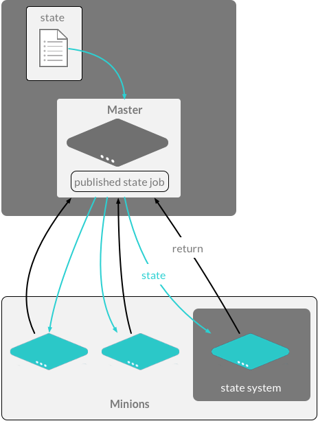

.. _states:

===========
Salt states
===========

Overview of Salt states
=======================

Salt states are used to deploy and manage infrastructure and to allow automation of recursive and predictable tasks.

Salt states can contain:

* Multi-language renderers
* Derivative state options
* Multiple data types for variable manipulation

State structure vs. terminal commands
=====================================

Every Salt state can be created with terminal commands from Salt execution modules.
However, this method has several limitations, such as the lack of conditional statements.
Salt state files are essentially batch files of terminal commands that can work around these limitations.

For example, this script installs a system as a working DNS server:

.. code-block:: bash

    #!/bin/bash

    # Install latest dns package
    salt \* pkg.latest bind

    # Lay down a new configuration file
    salt \* cp.get_file salt://dns/files/dns.conf /etc/named.conf

    # Start dns service
    salt \* service.start named

Salt state modules provide conditional statements that can answer such questions as:

* What if the package is already installed or needs to be upgraded?
* What if the service is already started? Does it need to be restarted?
* When setting permissions and ownership on the file, or copying the file from the Salt master to the target location, is it required to make additional calls to restart a service?

State language variations
=========================

YAML is the default language for creating Salt states. In additon, ``jinja2`` is used as a templating language to remove redundancy in states and state files.

In addition, other languages can be helpful for some scenarios:

* Python states allow complicated logic that otherwise cannot be created in YAML.
* JSON states are faster than YAML for computers to translate, but are less human-readable.

Salt State files are rendered on the ``salt-minion`` in a decentralized computational model.
This removes possible bottlenecks when rendering and executing modules on the ``salt-master``.

For more information, see the list of `Renderer Modules <https://docs.saltproject.io/en/latest/ref/renderers/all/index.html#all-salt-renderers>`__.

State modules
=============

When creating individual states, a ``module.function`` is specified from the state modules.
These state modules call their execution module counterparts, and either add or restrict options from the execution module for stateful operations.

Be aware that conficts may arise between state modules and execution modules.
For example, state modules do not have “status check” options for logs, so you must call the Salt action that determines the status.

For example, using the terminal to check and install the ``tree`` package:

.. code-block:: bash

    tree

.. code-block::

    # command output

    Command 'tree' not found, but can be installed with:
    sudo apt install tree

.. code-block:: bash

    sudo apt install tree

.. code-block::

    # command output

    Reading package lists... Done
    Building dependency tree
    Reading state information... Done
    The following NEW packages will be installed:
      tree
    [installed successfully]...

However, doing the same with a Salt state requires no check state, since the install state implicitly checks for the package in the system's package manager.

.. code-block:: sls
    :caption: /srv/salt/tree.sls

    install_tree_now:
      pkg.installed:
        - pkgs:
            - tree

.. code-block:: bash

    salt rebel_01 state.sls tree

.. code-block:: yaml

    # command output

    rebel_01:
    ----------
              ID: install_tree_now
        Function: pkg.installed
          Result: True
         Comment: The following packages were installed/updated: tree
         Started: 18:44:21.733166
        Duration: 7498.878 ms
         Changes:
                  ----------
                  tree:
                      ----------
                      new:
                          1.7.0-5
                      old:

    Summary for rebel_01
    ------------
    Succeeded: 1 (changed=1)
    Failed:    0
    ------------
    Total states run:     1
    Total run time:   7.499 s

The state SLS data structure
____________________________

A state definition in a state file will have the following components:

* **Identifier** is the identifier declaration for the state section.
* **State** is the name of the ``state`` module containing the function, such as ``pkg``.
* **Function** is the function to call in the named module, such as ``installed``.
* **Name** is the name of the state call, which is usually the name of the file to be managed or the name of the package to be installed.
* **Arguments** are the arguments that the state function will accept.

**Requisites** and **Declarations** are discussed in :ref:`requisites`.

An example of a single state layout in YAML, using the names of the high data components:

.. code-block:: sls
    :caption: /srv/salt/example.sls

    identifier:
      module.function:
        - name: name_value
        - function_arg: arg_value
        - function_arg: arg_value
        - function_arg: arg_value

Layers of data abstraction
__________________________

Another important feature of Salt is for that many packages, differences between platforms have been abstracted away and normalized. This reduces the amount of code that developers must write, and makes it easier to write code that is compatible over different platforms.
Salt will automatically evaluate the states using the correct package manager for the current platform.

Organizing states
=================

Salt states for a state tree should be written so that another developer can quickly ascertain the purpose of the Salt state and to see the workflow of the entire state tree.

A good practice is to reduce the complexity of the state tree by only using a few levels of nesting.
This will make the tree easier to navigate and lead to fewer problems down the line as a project matures:

.. code-block::

    /srv/salt
    ├── core.sls
    ├── httpd
    │ ├── files
    │ │ ├── apache2.conf
    │ │ └── httpd.conf
    │ └── init.sls
    ├── dns
    │ ├── files
    │ │ ├── bind.conf
    │ │ └── named.conf
    │ └── init.sls
    ├── ntp
    │ ├── files
    │ │ └── ntp.conf
    │ ├── init.sls
    │ ├── ntp-client.sls
    │ └── ntp-server.sls
    ├── redis
    │ ├── files
    │ │ └── redis.conf
    │ ├── init.sls
    │ └── map.jinja
    ├── ssh
    │ ├── files
    │ │ ├── ssh_config
    │ │ └── sshd_config
    │ ├── init.sls
    │ └── map.jinja
    └── top.sls

The Salt state tree ``file roots``
__________________________________

On the ``salt-master``, the ``file_roots`` option for determines where the state tree starts. By default this is ``/srv/salt`` directory.
The state tree directory is where all state files are found, along with any files related to the Salt states, such as application configuration files.

The ``top.sls`` file
____________________

Since some environments have hundreds of state files targeting thousands of minions, it is not practical to run each state individually and then target the applicable minions each time.

Salt offers two features to help with this scaling problem:

* The ``top.sls`` file, to map Salt states to the authorized minion
* ``highstate`` execution, to run all Salt states outlined in ``top.sls`` in a single Salt job

The ``top.sls`` file creates some general abstractions:

* Maps what nodes should pull from which environments
* Defines which states should be run from those environments

The contents and layout of the files are intended to be as simple as possible, while still allowing for maximum flexibility:

.. code-block:: sls
    :caption: /srv/salt/top.sls

    base:
      '*':
        - core
      '^(app|web).(qa|prod).loc$':
        - match: pcre
        - httpd
        - nagios.web
      'os:Ubuntu':
        - match: grain
        - repos.ubuntu
      'os_family:RedHat':
        - match: grain
        - repos.epel
      'nagios* or G@role:monitoring':
        - match: compound
        - nagios.server

* ``base`` is the default environment to use as the ``file_roots``.
* Targeting parameter is defined next.
* If a match type is anything other than minion ID globbing, then a **match** type must be defined.
* One or more state files are added as list items under the target.

Top file targeting types
________________________

Targeting in the top file can use the same matching types as the salt command-line by declaring the match option.

The default match type is a compound matcher. A single glob, when passed through the compound matcher, acts the same way as matching by ``glob``, so in most cases the two are indistinguishable.

.. list-table::
    :widths: 40 25 150
    :header-rows: 1

    * - Type
      - ??
      - Description

    * - glob
      - n/a
      - A glob match on minion ID

    * - pcre
      - E
      - A minion ID match using PCRE

    * - grain
      - ?
      - A match on grain data

    * - grain_pcre
      - P
      - A grain match using PCRE

    * - list
      - ?
      - A list of minion ID's (must be complete minion ID's)

    * - pillar
      - I
      - A match on pillar data

    * - pillar_pcre
      - ?
      - A pillar match using PCRE

    * - compound
      - n/a
      - A compound match of multiple match types

    * - ipcidr
      - ?
      - A match for expression in CIDR notation

    * - nodegroup
      - N
      - A match for pre-defined compound expressions

Running highstate using top files
_________________________________

When managing from the master, it is good practice to either manually run the command when the state tree is updated, or to execute from the master with a ``cron`` job.

Use the ``salt`` command to execute the ``state.highstate`` function:

.. code-block:: bash

    salt \* state.highstate

The entire highstate high data can be viewed by running:

.. code-block:: bash

    salt \* state.show_highstate

The output is similar to using ``state.show_sls`` for individual states.

Batching large jobs
___________________

While Salt can easily handle thousands of simultaneous state runs, for large clusters it may be desirable to have the master throttle the output in batches.

In this example, 10% of all the minions will be running ``state.highstate``:

.. code-block:: bash

    salt \* state.highstate --batch 10%

In this example, 10 minions will be running ``state.highstate``:

.. code-block:: bash

    salt \* state.highstate --batch 10

.. Note::

    If the minion population being targeted is larger than the percentage or count being batched, the currently targeted minions will constitute a sliding window with the batched amount.

Managing multiple environments
==============================

Multiple state trees can be created by defining multiple environments, which are declared by:

* Defining multiple environments in the master configuration
* Creating a top file configuration for each environment, or a common top file accessible to all environments which contain sections defining each environment
* Configuring minions to make requests from the Salt master to a single environment, or to override requests on the command line

Multiple environments structure on the Salt master
__________________________________________________

Multiple State Trees are defined by declaring more environments within the Salt Master configuration.
Each State Tree may have multiple paths defined.
This allows for a different State Tree for Production, Development, and QA.

If multiple environments are needed, separate ``file_roots`` can be created to serve more than just one State Tree:

.. code-block:: sls
    :caption: /etc/salt/master.d/file_roots.conf

    file_roots:
      base:
        - /srv/salt/base
      dev:
        - /srv/salt/dev1
        - /srv/salt/dev2
      qa:
        - /srv/salt/qa1
        - /srv/salt/qa2
      prod:
        - /srv/salt/prod

Multiple environments top file structure
________________________________________

The top file maps states from multiple environments to applicable minions in the salt cluster.
Each state tree environment may have a top.sls file.

* Each state tree environment may have a ``top.sls`` file:

  * The file must contain a reference to the environment being served.

  * The file may span multiple environments, however, this is not common

A file that spans multiple environments and is accessible to each environment might look like:

.. code-block:: sls

    base:
      '*':
        - core
    dev:
      'webserver*dev*':
        - webserver
      'db*dev*':
        - db
    qa:
      'webserver*qa*':
        - webserver
      'db*qa*':
        - db
    prod:
      'webserver*prod*':
        - webserver
      'db*prod*':
        - db

The ``top.sls`` file in this example would either need to be made available to each environment's ``file_roots`` as defined in the Salt master configuration.
This example could also be broken into four separate ``top.sls`` files, one in each environment's ``file_roots``.

Minion environment configuration
________________________________

A minion can be configured to only pull states from a specific environment using the following Salt minion configuration:

.. code-block:: sls
    :caption: /etc/salt/minion.d/environment.conf

    environment: prod

With this setting, the Salt minion would be limited to only viewing the ``file_roots`` path defined by the Salt master for the ``prod`` environment.

Multiple environment example
____________________________

This example shows how all state tree components collectively generate a highstate:

The steps include:

#. Defining the ``file_roots``
    #. Use a ``base`` environment as the default - not used in this scenario
    #. Create a ``prod`` environment for production states
    #. Create a ``dev`` environment for further state development
#. Creating the Salt states
    #. Disable USB storage on all systems from ``prod``
    #. Provide an SSH configuration files for both ``prod`` and ``dev``
    #. Provide an Apache configuration for ``dev`` and `prod` with a different name
#. Add resources for state runs
#. Create top file

Defining the file_roots
_______________________

The ``file_roots`` configuration:

.. code-block:: sls
    :caption: /etc/salt/master.d/file_roots.conf

    file_roots:
      base: # Not used in this example, but must be defined
        - /srv/salt/base
      dev:  # Not used in this example
        - /srv/salt/dev
      prod:
        - /srv/salt/prod

Create a disable USB storage state
__________________________________

The Disable USB Storage State in the ``base`` environment will look like:

.. code-block:: sls
    :caption: /srv/salt/prod/security/disable-usb.sls

    disable_usb:
      file.managed:
        - name: /etc/modprobe.d/blacklist-usbstorage
        - contents: |
            # Blacklist USB storage
            blacklist usb-storage

Create the SSH state
____________________

The SSH State file will look like:

.. code-block:: sls

    install_openssh:
      pkg.installed:
        - name: openssh

    push_ssh_conf:
      file.managed:
        - name: /etc/ssh/ssh_config
        - source: salt://ssh/ssh_config

    push_sshd_conf:
      file.managed:
        - name: /etc/ssh/sshd_config
        - source: salt://ssh/sshd_config

    start_sshd:
      service.running:
        - name: sshd
        - enable: True

Create the Apache state
_______________________

The Apache State file will look like:

.. code-block:: sls
    :caption: /srv/salt/dev/apache/init.sls

    implement_httpd:
      pkg.installed:
        - name: httpd

    http_conf:
      file.managed:
        - name: /etc/httpd/conf/httpd.conf
        - source: salt://apache/httpd.conf

    start_httpd:
      service.running:
        - name: httpd
        - enable: True

Create a ``firewalld`` state
____________________________

.. code-block:: sls
    :caption: /srv/salt/dev/firewalld/init.sls

    install_firewalld:
      pkg.installed:
          - name: firewalld

    firewalld_open_web:
      firewalld.present:
          - name: public
          - masquerade: False
          - ports:
              - 80/tcp
              - 443/tcp

Production build-out
____________________

All states in the Development State Tree ``/srv/salt/dev`` can be copied to the Production State Tree in :file:`/srv/salt/prod`.

In this example, to show that we have two environments, the ``apache/init.sls`` state is renamed to ``apache-prod/init.sls``.

Create the default top file
___________________________

The state ``top.sls`` will target all systems for ``ssh`` and only web servers will get the ``apache`` state.
The state will be copied by to both ``dev`` and ``prod`` State Tree paths.

.. code-block:: sls
    :caption: /etc/salt/master.d/file_roots.conf

    dev:
      '*':
        - ssh
      'G@role:web':
        - match: grain
        - apache
        - firewalld

    prod:
      '*':
        - ssh
        - security.disable-usb
      'G@role:web':
        - match: grain
        - apache-prod
        - firewalld

Test setup
__________

We can see the different state trees using the ``saltenv`` kwarg to override the minion's configured environment.

.. Note::

    All ``web`` minions have a ``role`` grain.

This example is in the ``dev`` environment:

.. code-block:: bash

    salt \* cp.list_states saltenv=dev

.. code-block:: sls

    # command output

    ns01:
      - ssh
      - top
    web01:
      - apache
      - firewalld
      - ssh
      - top

The example is in the ``prod`` environment.

.. code-block:: bash

    salt \* cp.list_states saltenv=prod

.. code-block:: sls

    # command output

    ns01:
      - security.disable-usb
      - ssh
      - top
    web01:
      - apache-prod
      - firewalld
      - security.disable-usb
      - ssh
      - top
